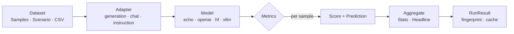

<p align="center">
  <a href="https://github.com/Lexsi-Labs/AuditKIT">
    <picture>
      <source media="(prefers-color-scheme: dark)" srcset="docs/assets/auditkit-logo-light.png">
      
    </picture>
  </a>
</p>

<p align="center">
  <b>Evaluate any model on any dataset and any task.</b><br>
  One library for benchmark, judge, code, red-team, security, and performance<br>
  evaluation — zero required deps.
</p>

<p align="center">
  <a href="https://pypi.org/project/auditkit/"></a>
  <a href="https://www.python.org/"></a>
  <a href="https://github.com/Lexsi-Labs/AuditKIT/blob/main/LICENSE.md"></a>
  <a href="https://lexsi-labs.github.io/AuditKIT/"></a>
  <a href="https://github.com/Lexsi-Labs/AuditKIT/actions"></a>
</p>

<p align="center">
  <a href="https://lexsi-labs.github.io/AuditKIT/">Documentation (internal)</a> ·
  <a href="#quickstart">Quickstart</a> ·
  <a href="#examples">Examples</a> ·
  <a href="docs/community/contributing.md">Contributing</a>
</p>

---

## TL;DR

| | |
|---|---|
| **What** | A unified Python library that evaluates any AI model on any dataset across any technique. |
| **Architecture** | 5-stage spine: Dataset → Adapter → Model → Metrics → RunResult. `ak.evaluate()` orchestrates it all. |
| **Techniques** | Benchmark, LLM-as-judge (GEval), code checks, RAG, hallucination, embedding similarity, toxicity/bias, pairwise/preference, red-teaming, security, performance |
| **Models** | 9 backends: OpenAI, Anthropic, HuggingFace, Lexsi, vLLM, LiteLLM, API, Groq, OpenRouter — all resolved via `AutoModel.resolve()`. Any `list[str] → list[str]` callable also works. |
| **Zero deps** | Core runs on stdlib. Backends and heavy metrics are optional extras (`pip install auditkit[openai]`). |
| **Fingerprints** | Every run gets a stable sha256 — results are cacheable, comparable, and reproducible by construction. |
| **Status** | 750+ tests, v1.0.0, LSAL-1.2 license (source-available, noncommercial). 10 metric families, 5 CLI subcommands, YAML config, MKDocs site. |

---

## Why AuditKIT

Evaluating AI models is fragmented. Academic benchmarks (MMLU, GSM8K) use one tool. LLM-as-judge evaluations use another. Red-teaming and performance profiling each have their own frameworks. There is no single library that does all of them with a consistent API, zero required dependencies, and a provenance-first data model.

AuditKIT is that library. It provides a unified evaluation spine that supports every technique, so you can compare results across benchmarks, judge evaluations, red-team probes, and performance profiles — all from a single `ak.evaluate()` call.

## Key features

- **Metric families.** Benchmark (exact match, F1, BLEU, ROUGE, ChrF), LLM-as-judge (GEval, rubric items), code/deterministic (contains, regex, JSON validation), RAG (lexical groundedness, context overlap/coverage), embedding similarity, hallucination detection, toxicity/bias, pairwise/preference (win rate, Elo, preference accuracy), security (DEFCON grade), performance (latency, throughput).
- **Zero required deps.** Core runs on the Python standard library alone. Heavy backends (BERTScore, vLLM, LiteLLM, OpenAI, Anthropic, HuggingFace) are optional extras.
- **Any model backend.** `echo` for testing, `openai:`, `anthropic:`, `hf:`, `lexsi:`, `vllm:`, `litellm:` (which also reaches Ollama, e.g. `litellm:ollama/llama3.1`), `api:`, `groq:`, `openrouter:`, or any callable. Auto-resolved via `AutoModel.resolve()`.
- **Many datasets, one model.** `evaluate_many()` runs one model across several datasets in a single call, returning one `RunResult` per dataset.
- **Red teaming.** Built-in adversarial probes (prompt injection, jailbreak, encoding, over-refusal) and detectors (keyword, refusal, injection success, system prompt leak) via `RedTeamRunner`.
- **Experiment tracking.** Named experiments with `ExperimentDB`, MLflow logging, cross-run comparison with bootstrap significance tests.
- **Model comparison.** `compare_models()` runs the same dataset against multiple models and produces side-by-side results with pairwise significance.
- **CLI with YAML config.** `auditkit eval`, `init`, `list`, `redteam`, `compare` subcommands. Define evaluations in YAML files with `prompts:`, model config, tags, and split strategies.
- **Provenance by default.** Every run writes a `RunResult` with a stable fingerprint (sha256 over model+seed+tasks+config). Results are cacheable and comparable by fingerprint.

## How it works



## Install

```bash
pip install auditkit                     # core (zero deps)
pip install "auditkit[openai]"           # OpenAI backend
pip install "auditkit[all]"              # all backends + heavy metrics
```

Requires Python 3.10+ on Linux, macOS, or Windows.

<details>
<summary>More install options</summary>

```bash
pip install "auditkit[anthropic]"            # Anthropic backend
pip install "auditkit[litellm]"              # LiteLLM (Ollama, etc.)
pip install "auditkit[vllm]"                 # vLLM backend
pip install "auditkit[transformers]"         # HuggingFace + hallucination + embedding similarity
pip install "auditkit[bert-score]"           # BERTScore
pip install "auditkit[mlflow]"               # MLflow experiment tracking

# From source
pip install "auditkit @ git+https://github.com/Lexsi-Labs/AuditKIT.git"
```

</details>

## Quickstart

```python
import auditkit as ak

samples = [
    ak.Sample(input="What is 2+2?", target="4"),
    ak.Sample(input="What is 3+3?", target="6"),
]

result = ak.evaluate(samples, model=lambda prompts: prompts)
print(result.summary())
```

**From the CLI:**

```bash
auditkit eval --model hf:gpt2 <<< "What is 2+2?"
```

**With a YAML config:**

```yaml
model: openai:gpt-4o-mini
temperature: 0.0
prompts:
  - "What is the capital of France?"
output: results.json
```

```bash
auditkit eval --config auditkit.yaml
```

## What it evaluates

| Task | Technique | Example metrics |
|------|-----------|-----------------|
| Benchmark text | MCQ, generation | `ExactMatch`, `Bleu`, `F1Score` |
| LLM output quality | LLM-as-judge | `GEval`, `RubricItem` |
| RAG pipelines | RAG | `LexicalGroundedness`, `ContextOverlap` |
| Safety | Red-team | `KeywordDetector`, `DefconGrade`, probes |
| Performance | Latency/throughput | `LatencyStats`, `Throughput` |

## Output

Every `evaluate()` returns a `RunResult`:

| Field | Contents |
|-------|----------|
| `headline` | Per-metric averages |
| `predictions` | Per-sample scores with input, output, expected |
| `stats` | Full statistics (mean, std, min, max, count) |
| `fingerprint` | Stable sha256 for caching and comparison |
| `config` | The `RunConfig` used (seed, temperature, etc.) |
| `errors` | Any errors encountered during the run |

## Examples

Colab-ready notebooks with real models and real datasets — see
[`examples/README.md`](examples/README.md) for the full, current list.

| Example | File |
|---------|------|
| Full pipeline: adapter, 5 metrics, LLM judge, LLM annotator | [`01_full_evaluation_pipeline.ipynb`](examples/01_full_evaluation_pipeline.ipynb) |
| Generation across two real HF model families, compared | [`02_generation_across_hf_families.ipynb`](examples/02_generation_across_hf_families.ipynb) |
| Custom annotators (regex, LLM-backed, fully custom) | [`03_custom_annotators.ipynb`](examples/03_custom_annotators.ipynb) |
| Metrics deep dive: built-in, custom, LLM-as-judge, RAG | [`04_metrics_deep_dive.ipynb`](examples/04_metrics_deep_dive.ipynb) |
| Every data type/task kind: generative, MCQ, RAG, precomputed, chat | [`05_data_types.ipynb`](examples/05_data_types.ipynb) |
| Model comparison deep dive: `compare_models()` + `RunComparison` | [`06_model_comparison.ipynb`](examples/06_model_comparison.ipynb) |
| Annotators across 4 real model families, then compared together | [`07_annotators_across_models.ipynb`](examples/07_annotators_across_models.ipynb) |
| `CompareResult` deep dive: what `compare_models()`'s native per-model support still can't express (different scorers per model), full method surface | [`08_compare_result_deep_dive.ipynb`](examples/08_compare_result_deep_dive.ipynb) |
| `GuardJudge` implementation check: all 5 profiles, real and offline | [`09_guard_judge_implementation_check.ipynb`](examples/09_guard_judge_implementation_check.ipynb) |
| `GuardJudge` with real, flagship guard models | [`10_guard_judge_legit_models.ipynb`](examples/10_guard_judge_legit_models.ipynb) |
| `EncoderJudge`: the base mechanism plus its two prebuilt subclasses | [`11_encoder_judge_prebuilts.ipynb`](examples/11_encoder_judge_prebuilts.ipynb) |
| Performance metrics on a real, large-scale evaluation | [`12_performance_metrics_demo.ipynb`](examples/12_performance_metrics_demo.ipynb) |

## Applications

Real-world scenarios answered end to end, not feature tours — see
[`examples/applications/README.md`](examples/applications/README.md). Only `01` uses the
`lm-evaluation-harness` integration (`ak.run_lmeval()`, needs
`auditkit[lmeval]`), as an authoritative cross-check alongside the native
evaluation; none of the others do.

| Application | File |
|-------------|------|
| How much does pruning severity (20%/40%/60%) degrade a model? Real BoolQ, real annotator, ship/no-ship verdicts, cross-checked via `ak.run_lmeval()` | [`01_application_pruned_llama_boolq.ipynb`](examples/applications/01_application_pruned_llama_boolq.ipynb) |
| Healthcare: clinical QA correctness vs. grounding (PubMedQA) | [`02_application_healthcare_pubmedqa.ipynb`](examples/applications/02_application_healthcare_pubmedqa.ipynb) |
| Finance: QA grounded in real SEC 10-K filings | [`03_application_finance_10k_qa.ipynb`](examples/applications/03_application_finance_10k_qa.ipynb) |
| E-commerce: review-sentiment triage at scale | [`04_application_ecommerce_review_triage.ipynb`](examples/applications/04_application_ecommerce_review_triage.ipynb) |
| Education: auto-graded tutoring, correctness vs. explanation | [`05_application_education_arc_tutor.ipynb`](examples/applications/05_application_education_arc_tutor.ipynb) |
| Enterprise search: internal knowledge assistant (real retrieval + RAG grounding) | [`06_application_enterprise_search_rag.ipynb`](examples/applications/06_application_enterprise_search_rag.ipynb) |
| LLM-as-judge via a real BERT NLI classifier, not a generative model | [`07_application_bert_nli_judge.ipynb`](examples/applications/07_application_bert_nli_judge.ipynb) |

## Repository map

| Directory | Description | README |
|-----------|-------------|--------|
| [`src/auditkit/`](src/auditkit/) | Core library — spine, runner, metrics, models, CLI | [README](src/auditkit/README.md) |
| [`src/auditkit/metrics/`](src/auditkit/metrics/) | Metric families | [README](src/auditkit/metrics/README.md) |
| [`src/auditkit/model/`](src/auditkit/model/) | Model backends (echo, openai, hf, vllm, etc.) | [README](src/auditkit/model/README.md) |
| [`src/auditkit/redteam/`](src/auditkit/redteam/) | Red team probes and detectors | [README](src/auditkit/redteam/README.md) |
| [`src/auditkit/scenarios/`](src/auditkit/scenarios/) | Built-in benchmark datasets | [README](src/auditkit/scenarios/README.md) |
| [`tests/`](tests/) | Test suite (750+ tests) | [README](tests/README.md) |
| [`examples/`](examples/) | Colab-ready example notebooks | [README](examples/README.md) |
| [`examples/applications/`](examples/applications/) | Real-world application notebooks | [README](examples/applications/README.md) |
| [`docs/`](docs/) | MkDocs documentation site (internal, requires Lexsi SSO) | [index](docs/index.md) |

---

## Developed by Lexsi Labs

<p align="center">
  Created by the team at <strong>Lexsi Labs</strong>, AuditKIT provides a unified evaluation spine for AI models across every technique and modality.
</p>

---

## License

This project is released under the [Lexsi Labs Source Available License (LSAL) v1.2](LICENSE.md) — free for academic research and teaching on MIT-like terms; use by any organization requires written acknowledgement or permission (Section 1A); a separate commercial license is required to sell it or embed it in a paid product.

---

## Join Community / Contribute

- Issues and discussions are welcomed on the [GitHub issue tracker](https://github.com/Lexsi-Labs/AuditKIT/issues).
- See the **Contributing** section for contribution standards, code reviews, and documentation tips.
