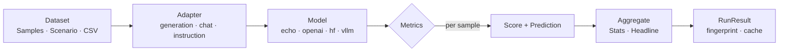

<p align="center">
  <a href="https://github.com/Lexsi-Labs/AuditKIT">
    <picture>
      <source media="(prefers-color-scheme: dark)" srcset="https://raw.githubusercontent.com/Lexsi-Labs/AuditKIT/main/docs/assets/auditkit-logo-white.png">
      
    </picture>
  </a>
</p>

<p align="center">
  <b>Evaluate any model on any dataset and any task.</b><br>
  One library for benchmark, judge, code, red-team, security, and performance<br>
  evaluation — zero required deps.
</p>

<p align="center">
  <a href="https://pypi.org/project/auditkit/"></a>
  <a href="https://www.python.org/"></a>
  <a href="https://github.com/Lexsi-Labs/AuditKIT/blob/main/LICENSE.md"></a>
  <a href="https://auditkit.lexsi.ai/"></a>
  <a href="https://discord.gg/MhVUGVYE8q"></a>
  <a href="https://github.com/Lexsi-Labs/AuditKIT/actions"></a>
</p>

<p align="center">
  <a href="https://auditkit.lexsi.ai/">Documentation</a> ·
  <a href="#quickstart">Quickstart</a> ·
  <a href="#examples">Examples</a> ·
  <a href="docs/community/contributing.md">Contributing</a>
</p>

---

## TL;DR

| | |
|---|---|
| **What** | A unified Python library that evaluates any AI model on any dataset across any technique. |
| **Architecture** | 5-stage spine: Dataset → Adapter → Model → Metrics → RunResult. `ak.evaluate()` orchestrates it all. |
| **Techniques** | Benchmark, LLM-as-judge (GEval), code checks, RAG, hallucination, embedding similarity, toxicity/bias, pairwise/preference, red-teaming, security, performance, agent/tool use |
| **Models** | 10 backends: OpenAI, Anthropic, HuggingFace, Lexsi, vLLM, LiteLLM, API, Groq, OpenRouter, Agent (HTTP endpoint) — all resolved via `AutoModel.resolve()`. Any `list[str] → list[str]` callable also works. |
| **Zero deps** | Core runs on stdlib. Backends and heavy metrics are optional extras (`pip install auditkit[openai]`). |
| **Fingerprints** | Every run gets a stable sha256 — results are cacheable, comparable, and reproducible by construction. |
| **Status** | ~3,000 tests, v1.1.2, LSAL-1.2 license (source-available, noncommercial). 11 metric families, 6 CLI subcommands, YAML config, MKDocs site. |

---

## Why AuditKIT

Evaluating AI models is fragmented. Academic benchmarks (MMLU, GSM8K) use one tool. LLM-as-judge evaluations use another. Red-teaming and performance profiling each have their own frameworks. There is no single library that does all of them with a consistent API, zero required dependencies, and a provenance-first data model.

AuditKIT is that library. It provides a unified evaluation spine that supports every technique, so you can compare results across benchmarks, judge evaluations, red-team probes, and performance profiles — all from a single `ak.evaluate()` call.

## Key features

- **Metric families.** Benchmark (exact match, F1, BLEU, ROUGE, ChrF), LLM-as-judge (GEval, rubric items), code/deterministic (contains, regex, JSON validation), RAG (lexical groundedness, context overlap/coverage), embedding similarity, hallucination detection, toxicity/bias, pairwise/preference (win rate, Elo, preference accuracy), security (DEFCON grade), performance (latency, throughput).
- **Zero required deps.** Core runs on the Python standard library alone. Heavy backends (BERTScore, vLLM, LiteLLM, OpenAI, Anthropic, HuggingFace) are optional extras.
- **Any model backend.** `echo` for testing, `openai:`, `anthropic:`, `hf:`, `lexsi:`, `vllm:`, `litellm:` (which also reaches Ollama, e.g. `litellm:ollama/llama3.1`), `api:`, `groq:`, `openrouter:`, `agent:` (a deployed agent over HTTP), or any callable. Auto-resolved via `AutoModel.resolve()`.
- **Many datasets, one model.** `evaluate_many()` runs one model across several datasets in a single call, returning one `RunResult` per dataset.
- **Red teaming.** Built-in adversarial probes (prompt injection, jailbreak, encoding, over-refusal) and detectors (keyword, refusal, injection success, system prompt leak) via `RedTeamRunner`.
- **Agent and RAG evaluation.** Score tool calls, parallel/dependency behavior and retrieval on any model. The `auditkit.agent_eval` layer evaluates a whole task episode: a verified outcome (final state, artifact, answer, or a custom predicate) as the headline, with tool, trace and judge scores as diagnostics. It reads recorded runs (AgentTune, OpenAI messages, a `Sample` trace) or calls a deployed `agent:` endpoint, and works with any framework that emits OpenAI messages or serves over HTTP.
- **Experiment tracking.** Named experiments with `ExperimentDB`, MLflow logging, cross-run comparison with bootstrap significance tests.
- **Model comparison.** `compare_models()` runs the same dataset against multiple models and produces side-by-side results with pairwise significance.
- **CLI with YAML config.** `auditkit eval`, `init`, `list`, `redteam`, `compare`, `agent` subcommands. Define evaluations in YAML files with `prompts:`, model config, tags, and split strategies.
- **Provenance by default.** Every run writes a `RunResult` with a stable fingerprint (sha256 over model+seed+tasks+config). Results are cacheable and comparable by fingerprint.

## How it works


```mermaid
flowchart LR
    A["Dataset<br/>Samples · Scenario · CSV"] --> B["Adapter<br/>generation · chat · instruction"]
    B --> C["Model<br/>echo · openai · hf · vllm"]
    C --> D{"Metrics"}
    D -->|per sample| E["Score + Prediction"]
    E --> F["Aggregate<br/>Stats · Headline"]
    F --> G["RunResult<br/>fingerprint · cache"]
```

## Install

```bash
pip install auditkit                     # core (zero deps)
pip install "auditkit[openai]"           # OpenAI backend
pip install "auditkit[all]"              # all backends + heavy metrics
```

Requires Python 3.10+ on Linux, macOS, or Windows.

<details>
<summary>More install options</summary>

```bash
pip install "auditkit[anthropic]"            # Anthropic backend
pip install "auditkit[litellm]"              # LiteLLM (Ollama, etc.)
pip install "auditkit[vllm]"                 # vLLM backend
pip install "auditkit[transformers]"         # HuggingFace + hallucination + embedding similarity
pip install "auditkit[bert-score]"           # BERTScore
pip install "auditkit[mlflow]"               # MLflow experiment tracking

# From source
pip install "auditkit @ git+https://github.com/Lexsi-Labs/AuditKIT.git"
```

</details>

## Quickstart

```python
import auditkit as ak

samples = [
    ak.Sample(input="What is 2+2?", target="4"),
    ak.Sample(input="What is 3+3?", target="6"),
]

result = ak.evaluate(samples, model=lambda prompts: prompts)
print(result.summary())
```

**From the CLI:**

```bash
auditkit eval --model hf:gpt2 <<< "What is 2+2?"
```

**With a YAML config:**

```yaml
model: openai:gpt-4o-mini
temperature: 0.0
prompts:
  - "What is the capital of France?"
output: results.json
```

```bash
auditkit eval --config auditkit.yaml
```

### Cohere / Aya models

Aya Expanse, Tiny Aya, Aya Vision and North Micro Vision run on the `hf:` backend
(`pip install "auditkit[transformers,vision]"`, transformers 5.15 or newer).
Score a model before and after fine-tuning:

```python
import auditkit as ak

samples = [ak.Sample(input="Translate to French: good morning", target="bonjour")]
metrics = ["exact_match", "f1_score"]

base = ak.evaluate(samples, "hf:CohereLabs/aya-expanse-8b", metrics)
tuned = ak.evaluate(samples, "hf:<you>/aya-expanse-8b-tuned", metrics)
print(ak.compare(base, tuned).summary())
```

For the vision models (`CohereLabs/aya-vision-8b`, `CohereLabs/aya-vision-32b`,
`CohereLabs/North-Micro-Vision-Instruct`), attach images to the sample; on the `hf:`
backend they go through the model's processor:

```python
from PIL import Image

sample = ak.Sample(input="What does this chart show?", target="sales by month",
                   images=[Image.open("chart.png")])
result = ak.evaluate([sample], "hf:CohereLabs/aya-vision-8b", ["f1_score"])
```

**Images travel on `hf:` and on `api:` in chat mode**, whichever host `api:` points
at: a self-hosted vLLM or SGLang server, or a hosted provider. `api:` raw-prompt mode raises
rather than drop them. The offline `vllm:` backend doesn't read `Sample.images` yet and drops
them **without an error**: for a vision eval on vLLM, `vllm serve` the model and use `api:`.

Aya Vision **does** work text-only on `hf:` — measured, vision tower unused, 5/5 on a
five-language probe, and identical to Aya Expanse 8B on the same probe. For text
work prefer Expanse: same quality or better, and it runs natively on vLLM and SGLang,
where Aya Vision needs each one's Transformers backend.

The Cohere models run on `hf:`, `vllm:` and SGLang (all nine measured on each), but not all natively. Aya Vision has no native server class (vLLM
dropped it after 0.24.0, SGLang never had it), so both servers run it through their
Transformers backends: automatically on vLLM, with `compat.py --patch-sglang` on SGLang. North Micro Vision is native on vLLM; on SGLang
it needs transformers >= 5.15 in the SGLang env plus `--patch-sglang`. Tiny Aya and Aya Expanse
are native on both. The full
model-by-runtime table is in [docs/model_backends.md](https://github.com/Lexsi-Labs/AuditKIT/blob/main/docs/model_backends.md).

Tiny Aya (`CohereLabs/tiny-aya-global` and siblings `fire`, `water`, `earth`),
Aya Expanse and Aya Vision are gated
on the Hub: accept the licence on the model page, then set `HF_TOKEN` (or pass `token=` to
`auditkit.model.hf_gen.HFGenModel`). North Micro Vision is not gated.

## What it evaluates

| Task | Technique | Example metrics |
|------|-----------|-----------------|
| Benchmark text | MCQ, generation | `ExactMatch`, `Bleu`, `F1Score` |
| LLM output quality | LLM-as-judge | `GEval`, `RubricItem` |
| RAG pipelines | RAG | `LexicalGroundedness`, `ContextOverlap` |
| Safety | Red-team | `KeywordDetector`, `DefconGrade`, probes |
| Performance | Latency/throughput | `LatencyStats`, `Throughput` |

## Output

Every `evaluate()` returns a `RunResult`:

| Field | Contents |
|-------|----------|
| `headline` | Per-metric averages |
| `predictions` | Per-sample scores with input, output, expected |
| `stats` | Full statistics (mean, std, min, max, count) |
| `fingerprint` | Stable sha256 for caching and comparison |
| `config` | The `RunConfig` used (seed, temperature, etc.) |
| `errors` | Any errors encountered during the run |

## Examples

Colab-ready notebooks with real models and real datasets — see
[`examples/README.md`](https://github.com/Lexsi-Labs/AuditKIT/blob/main/examples/README.md) for the full, current list.

| Example | File |
|---------|------|
| Full pipeline: adapter, 5 metrics, LLM judge, LLM annotator | [`01_full_evaluation_pipeline.ipynb`](https://github.com/Lexsi-Labs/AuditKIT/blob/main/examples/01_full_evaluation_pipeline.ipynb) |
| Generation across two real HF model families, compared | [`02_generation_across_hf_families.ipynb`](https://github.com/Lexsi-Labs/AuditKIT/blob/main/examples/02_generation_across_hf_families.ipynb) |
| Custom annotators (regex, LLM-backed, fully custom) | [`03_custom_annotators.ipynb`](https://github.com/Lexsi-Labs/AuditKIT/blob/main/examples/03_custom_annotators.ipynb) |
| Metrics deep dive: built-in, custom, LLM-as-judge, RAG | [`04_metrics_deep_dive.ipynb`](https://github.com/Lexsi-Labs/AuditKIT/blob/main/examples/04_metrics_deep_dive.ipynb) |
| Every data type/task kind: generative, MCQ, RAG, precomputed, chat | [`05_data_types.ipynb`](https://github.com/Lexsi-Labs/AuditKIT/blob/main/examples/05_data_types.ipynb) |
| Model comparison deep dive: `compare_models()` + `RunComparison` | [`06_model_comparison.ipynb`](https://github.com/Lexsi-Labs/AuditKIT/blob/main/examples/06_model_comparison.ipynb) |
| Annotators across 4 real model families, then compared together | [`07_annotators_across_models.ipynb`](https://github.com/Lexsi-Labs/AuditKIT/blob/main/examples/07_annotators_across_models.ipynb) |
| `CompareResult` deep dive: what `compare_models()`'s native per-model support still can't express (different scorers per model), full method surface | [`08_compare_result_deep_dive.ipynb`](https://github.com/Lexsi-Labs/AuditKIT/blob/main/examples/08_compare_result_deep_dive.ipynb) |
| `GuardJudge` implementation check: all 5 profiles, real and offline | [`09_guard_judge_implementation_check.ipynb`](https://github.com/Lexsi-Labs/AuditKIT/blob/main/examples/09_guard_judge_implementation_check.ipynb) |
| `GuardJudge` with real, flagship guard models | [`10_guard_judge_legit_models.ipynb`](https://github.com/Lexsi-Labs/AuditKIT/blob/main/examples/10_guard_judge_legit_models.ipynb) |
| `EncoderJudge`: the base mechanism plus its two prebuilt subclasses | [`11_encoder_judge_prebuilts.ipynb`](https://github.com/Lexsi-Labs/AuditKIT/blob/main/examples/11_encoder_judge_prebuilts.ipynb) |
| Performance metrics on a real, large-scale evaluation | [`12_performance_metrics_demo.ipynb`](https://github.com/Lexsi-Labs/AuditKIT/blob/main/examples/12_performance_metrics_demo.ipynb) |
| SGLang: environment checks, server mode via `api:`, tool calls and parallel tool calls | [`13_sglang_compatibility.ipynb`](https://github.com/Lexsi-Labs/AuditKIT/blob/main/examples/13_sglang_compatibility.ipynb) |
| Agent and RAG evals: tool calls, parallel tool calls, deployed agent endpoints, AgentTune data, retrieval and judged RAG metrics | [`14_agent_and_rag_evals.ipynb`](https://github.com/Lexsi-Labs/AuditKIT/blob/main/examples/14_agent_and_rag_evals.ipynb) |
| End-to-end agent evaluation, fully offline (`.py` script): recorded episodes, a verified state outcome, and a fabricated answer that does not pass a state case | [`agent_eval_offline.py`](https://github.com/Lexsi-Labs/AuditKIT/blob/main/examples/agent_eval_offline.py) |

## Applications

Real-world scenarios answered end to end, not feature tours — see
[`examples/applications/README.md`](https://github.com/Lexsi-Labs/AuditKIT/blob/main/examples/applications/README.md). Only `01` uses the
`lm-evaluation-harness` integration (`ak.run_lmeval()`, needs
`auditkit[lmeval]`), as an authoritative cross-check alongside the native
evaluation; none of the others do.

| Application | File |
|-------------|------|
| How much does pruning severity (20%/40%/60%) degrade a model? Real BoolQ, real annotator, ship/no-ship verdicts, cross-checked via `ak.run_lmeval()` | [`01_application_pruned_llama_boolq.ipynb`](https://github.com/Lexsi-Labs/AuditKIT/blob/main/examples/applications/01_application_pruned_llama_boolq.ipynb) |
| Healthcare: clinical QA correctness vs. grounding (PubMedQA) | [`02_application_healthcare_pubmedqa.ipynb`](https://github.com/Lexsi-Labs/AuditKIT/blob/main/examples/applications/02_application_healthcare_pubmedqa.ipynb) |
| Finance: QA grounded in real SEC 10-K filings | [`03_application_finance_10k_qa.ipynb`](https://github.com/Lexsi-Labs/AuditKIT/blob/main/examples/applications/03_application_finance_10k_qa.ipynb) |
| E-commerce: review-sentiment triage at scale | [`04_application_ecommerce_review_triage.ipynb`](https://github.com/Lexsi-Labs/AuditKIT/blob/main/examples/applications/04_application_ecommerce_review_triage.ipynb) |
| Education: auto-graded tutoring, correctness vs. explanation | [`05_application_education_arc_tutor.ipynb`](https://github.com/Lexsi-Labs/AuditKIT/blob/main/examples/applications/05_application_education_arc_tutor.ipynb) |
| Enterprise search: internal knowledge assistant (real retrieval + RAG grounding) | [`06_application_enterprise_search_rag.ipynb`](https://github.com/Lexsi-Labs/AuditKIT/blob/main/examples/applications/06_application_enterprise_search_rag.ipynb) |
| LLM-as-judge via a real BERT NLI classifier, not a generative model | [`07_application_bert_nli_judge.ipynb`](https://github.com/Lexsi-Labs/AuditKIT/blob/main/examples/applications/07_application_bert_nli_judge.ipynb) |

## Repository map

| Directory | Description | README |
|-----------|-------------|--------|
| [`src/auditkit/`](https://github.com/Lexsi-Labs/AuditKIT/tree/main/src/auditkit/) | Core library — spine, runner, metrics, models, CLI | [README](https://github.com/Lexsi-Labs/AuditKIT/blob/main/src/auditkit/README.md) |
| [`src/auditkit/metrics/`](https://github.com/Lexsi-Labs/AuditKIT/tree/main/src/auditkit/metrics/) | Metric families | [README](https://github.com/Lexsi-Labs/AuditKIT/blob/main/src/auditkit/metrics/README.md) |
| [`src/auditkit/model/`](https://github.com/Lexsi-Labs/AuditKIT/tree/main/src/auditkit/model/) | Model backends (echo, openai, hf, vllm, etc.) | [README](https://github.com/Lexsi-Labs/AuditKIT/blob/main/src/auditkit/model/README.md) |
| [`src/auditkit/redteam/`](https://github.com/Lexsi-Labs/AuditKIT/tree/main/src/auditkit/redteam/) | Red team probes and detectors | [README](https://github.com/Lexsi-Labs/AuditKIT/blob/main/src/auditkit/redteam/README.md) |
| [`src/auditkit/scenarios/`](https://github.com/Lexsi-Labs/AuditKIT/tree/main/src/auditkit/scenarios/) | Built-in benchmark datasets | [README](https://github.com/Lexsi-Labs/AuditKIT/blob/main/src/auditkit/scenarios/README.md) |
| [`tests/`](https://github.com/Lexsi-Labs/AuditKIT/tree/main/tests/) | Test suite (~3,000 tests) | [README](https://github.com/Lexsi-Labs/AuditKIT/blob/main/tests/README.md) |
| [`examples/`](https://github.com/Lexsi-Labs/AuditKIT/tree/main/examples/) | Colab-ready example notebooks | [README](https://github.com/Lexsi-Labs/AuditKIT/blob/main/examples/README.md) |
| [`examples/applications/`](https://github.com/Lexsi-Labs/AuditKIT/tree/main/examples/applications/) | Real-world application notebooks | [README](https://github.com/Lexsi-Labs/AuditKIT/blob/main/examples/applications/README.md) |
| [`docs/`](https://github.com/Lexsi-Labs/AuditKIT/tree/main/docs/) | MkDocs source for [auditkit.lexsi.ai](https://auditkit.lexsi.ai/) | [index](https://github.com/Lexsi-Labs/AuditKIT/blob/main/docs/index.md) |

---

## Developed by Lexsi Labs

<p align="center">
  Created by the team at <strong>Lexsi Labs</strong>, AuditKIT provides a unified evaluation spine for AI models across every technique and modality.
</p>

Shreeyans Arora · Utsav Avaiya · Zera Lyngkhoi · Ram Mohan Rao Kadiyala · Hem Gosalia · Vinay Kumar Sankarapu · Pratinav Seth

---

## Citation

If you use AuditKIT in research, please cite it:

```bibtex
@software{auditkit2026,
  title  = {AuditKIT: one library to evaluate any model on any dataset and any task},
  author = {Arora, Shreeyans and Avaiya, Utsav and Lyngkhoi, Zera and
            Kadiyala, Ram Mohan Rao and Gosalia, Hem and Sankarapu, Vinay Kumar and
            Seth, Pratinav},
  year   = {2026},
  version = {1.1.2},
  url    = {https://github.com/Lexsi-Labs/AuditKIT}
}
```

`CITATION.cff` carries the same author list for GitHub's citation widget.

---

## License

This project is released under the [Lexsi Labs Source Available License (LSAL) v1.2](https://github.com/Lexsi-Labs/AuditKIT/blob/main/LICENSE.md) — free for academic research and teaching on MIT-like terms; use by any organization requires written acknowledgement or permission (Section 1A); a separate commercial license is required to sell it or embed it in a paid product.

---

## Join Community / Contribute

- Issues and discussions are welcomed on the [GitHub issue tracker](https://github.com/Lexsi-Labs/AuditKIT/issues).
- Questions and chat: join the [Lexsi Labs Discord](https://discord.gg/MhVUGVYE8q).
- See [Contributing](https://github.com/Lexsi-Labs/AuditKIT/blob/main/docs/community/contributing.md) for the development setup, code standards and the pull request process.
