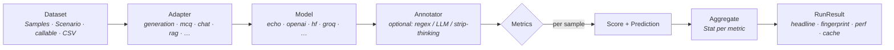
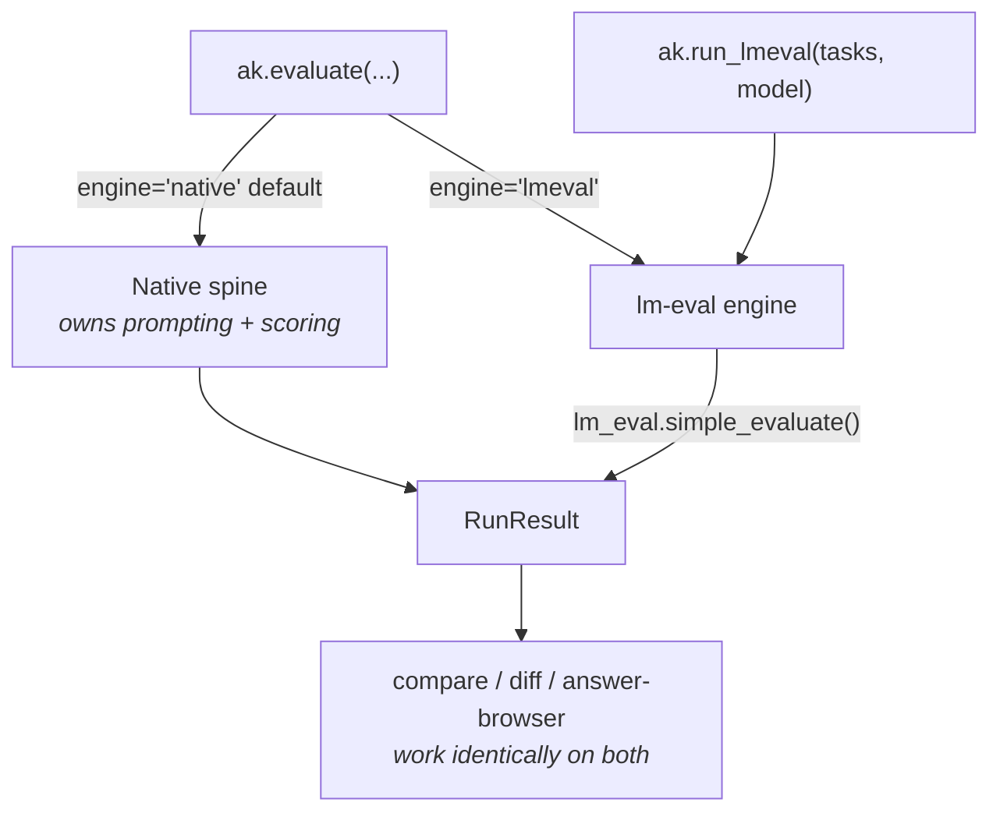
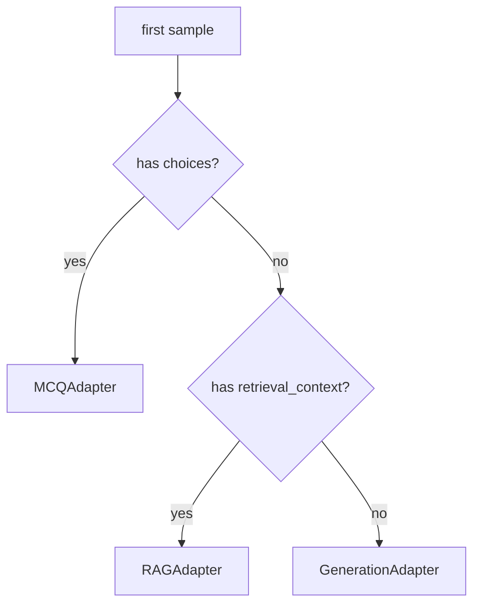
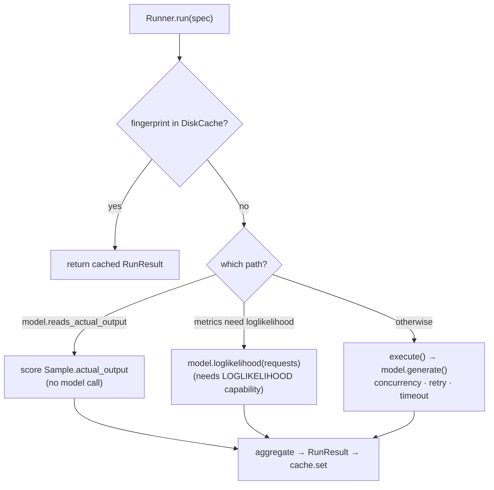

<!--
  AuditKIT — Complete Technical Guide
  Verified against the AuditKit 1.0.0 source.
  Renders on GitHub (mermaid + tables) and as a hosted page.
-->

# AuditKIT — Complete Technical Guide

> **Version:** 1.0.0 · **Python:** ≥ 3.10 · **License:** LSAL v1.2
>
> This guide is written **against the actual code on this branch**, not the marketing README. Where the code diverges from older docs (the top-level `README.md` and the docstrings), this guide follows the code and calls the divergence out. This guide states limitations inline, in context, wherever they matter. Nothing is hidden to make a feature look better than it is.

---

## Table of contents

1. [What AuditKIT is, and why it exists](#1-what-auditkit-is-and-why-it-exists)
2. [Install & optional extras](#2-install--optional-extras)
3. [The mental model & architecture](#3-the-mental-model--architecture)
4. [Core concepts (the data model)](#4-core-concepts-the-data-model)
5. [The Python API](#5-the-python-api)
6. [Configuration reference — `RunConfig`](#6-configuration-reference--runconfig)
7. [Model backends](#7-model-backends)
8. [Two engines: native vs lm-eval](#8-two-engines-native-vs-lm-eval)
9. [Adapters & routing](#9-adapters--routing)
10. [The metric catalog (all 42)](#10-the-metric-catalog-all-42)
11. [LLM-as-judge](#11-llm-as-judge)
12. [Comparison & experiments](#12-comparison--experiments)
13. [Red-teaming (future work)](#13-red-teaming-future-work--not-part-of-this-release)
14. [Performance metrics](#14-performance-metrics)
15. [CLI & YAML reference](#15-cli--yaml-reference)
16. [Scenarios & data loading](#16-scenarios--data-loading)
17. [Extending AuditKIT](#17-extending-auditkit)
18. [Known limitations (consolidated)](#18-known-limitations-consolidated)
19. [Appendix: glossary & file map](#19-appendix-glossary--file-map)

---

## 1. What AuditKIT is, and why it exists

**AuditKIT (`auditkit`, imported as `ak`) is a single Python library for evaluating any AI model, on any dataset, across any technique — through one call, `ak.evaluate()`.**

Model evaluation today is fragmented: academic benchmarks (MMLU, GSM8K) live in one tool, LLM-as-judge in another, RAG and performance profiling in yet others. Each has its own data model, so results can't be compared across techniques. AuditKIT unifies them behind **one evaluation spine** and **one result object** (`RunResult`) with a **stable fingerprint**, so a benchmark run, a judge run, and a RAG run are all the same shape — cacheable, diffable, and reproducible by construction.

**What it does:**

| Technique | What you get | Example scorers |
|---|---|---|
| Academic benchmarks | MCQ / generative accuracy via the real lm-eval-harness | `arc_easy`, `gsm8k`, `mmlu` (lm-eval tasks) |
| Deterministic checks | Exact/fuzzy string, JSON, regex, edit distance | `exact_match`, `contains`, `is_json`, `f1_score` |
| Generation quality | Overlap metrics | `bleu`, `rouge_l`, `chrf`, `word_error_rate` |
| LLM-as-judge | Model-graded classifier / numeric / rubric | `LLMJudge`, `GEval`, `Factuality`, `Relevance` |
| RAG | Groundedness / context quality | `lexical_groundedness`, `context_coverage`, `context_overlap` |
| Embedding similarity | Semantic closeness | `cosine_similarity`, `token_overlap`, `bm25_similarity` |
| Safety / toxicity | Toxicity, demographic representation, hate-speech, LLM-judge bias | `toxicity_score`, `representation_skew`, `hate_speech_score`, `bias_judge` |
| Security | Keyword detection + guard-model safety scoring | `keyword_detector`, `guard_judge` |
| Model comparison | Base-vs-pruned, N-model bake-offs, significance | `compare_models()`, `RunComparison` |
| Performance | Latency / throughput / model-size / tokens / cost | measured automatically on every run |

**Design commitments (enforced, not aspirational):**

- **Zero required third-party dependencies.** The core runs on the Python standard library. Every backend and heavy metric is an *optional extra* that is imported lazily and raises a clear `ExtraNotInstalled` with a `pip install` hint if missing — never an import-time crash. (`pyproject.toml` declares `dependencies = []`.)
- **Provenance by default.** Every run produces a `RunResult` carrying a `fingerprint` (a sha256 over model + config + tasks + scorers). Identical inputs → identical fingerprint → a disk-cache hit. Change any knob and the fingerprint changes.
- **The spine never changes to add a feature.** A new modality, technique, or backend is a new plugin file + one registry line — never an edit to `runner.py`/`score.py`/`sample.py`.

> **Candor — what was recently removed.** AuditKit deliberately excludes four feature families: **multimodal, agentic, conversation, and tabular** evaluation. Their modules and metrics are gone. If you read older docs describing `Conversation`/`Turn`/`evaluate_conversation()` or agent traces — those are **stale**; none of it exists in this release. This guide documents only what is present.

---

## 2. Install & optional extras

```bash
pip install auditkit                 # core, zero third-party deps
pip install "auditkit[openai]"       # + OpenAI backend
pip install "auditkit[all]"          # everything
```

The complete extras table (from `pyproject.toml`):

| Extra | Pulls in | Unlocks |
|---|---|---|
| `openai` | `openai` | `openai:` backend |
| `anthropic` | `anthropic` | `anthropic:` backend |
| `transformers` | `torch`, `transformers` | `hf:` backend, `perplexity`, `factual_consistency`, `toxicity_score`(model), `hate_speech_score`(model) |
| `lmeval` | `lm-eval`, `accelerate` | the **lm-eval engine** (`ak.run_lmeval`, `engine="lmeval"`) |
| `vision` | `pillow`, `torchmetrics` | (declared; note the multimodal *code* was removed — see §1) |
| `interop` | `datasets`, `mlcroissant` | native built-in scenarios (`load_hf`, `load_croissant`) |
| `mlflow` | `mlflow` | `Experiment.log_mlflow()`, `lexsi:` MLflow logging |
| `requests` | `requests` | `api:`, `groq:`, `openrouter:`, `lexsi:` backends |
| `vllm` | `vllm` | `vllm:` backend |
| `litellm` | `litellm` | `litellm:` backend (Ollama, 100+ providers) |
| `bert-score` | `bert-score`, `torch` | `bert_score` metric |
| `dev` | `pytest`, `pytest-asyncio`, `pytest-mock` | test suite |
| `all` | all of the above | — |

> **Candor — extra-hint mismatches.** Two lazy imports print a hint that doesn't match the real extra name: `bert_score` says `pip install bert-score` (works, but the extra is spelled `bert-score`), and `LexsiModel`'s missing-`requests` hint is a bare `pip install requests` rather than `auditkit[requests]`. Harmless, but you'll see it. There is **no standalone `groq` extra** — the Groq backend rides the `requests` extra.

---

## 3. The mental model & architecture

Everything flows through one directional pipeline, **the spine**, driven by `runner.py`:



Each stage is a swappable plugin resolved from a **registry**. `ak.evaluate()` composes them into a `RunSpec`, the `Runner` executes it, and you get a `RunResult` back.

### Two engines behind one API

AuditKIT has **two independent execution engines**, both returning the *same* `RunResult`:



- **Native engine** (`engine="native"`, the default): AuditKIT owns the whole pipeline above — it builds prompts via adapters, calls the model backend, and scores with its own metrics.
- **lm-eval engine** (`engine="lmeval"` or the dedicated `ak.run_lmeval()`): delegates to the real [lm-evaluation-harness](https://github.com/EleutherAI/lm-evaluation-harness) — its task templates, filters, and metrics — then maps lm-eval's aggregates + per-doc samples back into a `RunResult`. Requires `auditkit[lmeval]`. See [§8](#8-two-engines-native-vs-lm-eval).

> The native `scenarios/` package (mmlu, gsm8k, …) is a **separate reimplementation** that does *not* use lm-eval, and most of it is broken (see [§16](#16-scenarios--data-loading)). For academic benchmarks, use `ak.run_lmeval()` (the lm-eval engine) — that's the maintained path.

### Provenance & caching

```mermaid
flowchart LR
    S["RunSpec<br/>model+adapter+metrics+config"] -->|fingerprint&#40;&#41;| FP["sha256[:16]"]
    FP --> C{"DiskCache<br/>~/.cache/auditkit/runs/"}
    C -->|hit| RR["cached RunResult (instant)"]
    C -->|miss| RUN["run the spine"] --> RR
    RUN -.->|cache.set| C
```



`RunSpec.fingerprint()` hashes the model identity, scenario name, adapter identity (incl. its prompt template/system prompt), each metric's identity (a judge folds in its model + prompt + choices), the annotators, and the **entire** `RunConfig`. Any change to any of these changes the fingerprint and forces a fresh run. This is what makes `compare()` and the disk cache correct.

---

## 4. Core concepts (the data model)

### `Sample` — one evaluation example

```python
ak.Sample(
    input,                       # str (required) — the prompt/question
    target=None,                 # str | int — gold answer (None = no gold)
    id=None,                     # str — stable id (auto-assigned if None)
    task="",                     # str — free-form task label (groups per-task deltas)
    kind=TaskKind.GENERATIVE,    # TaskKind enum
    choices=None,                # list[str] — MCQ options (presence → MCQ routing)
    retrieval_context=None,      # list[str] — RAG context (presence → RAG routing)
    metadata={},                 # dict — anything; judge prompts can reference keys
    tags=[],                     # list[str]
    actual_output=None,          # str — pre-generated output (precomputed/generate flow)
)
```
- `sample.is_golden` → `target is not None`. When `scorers=None`, this decides whether `ExactMatch` is auto-selected.
- **Two fields drive automatic adapter routing**: `choices` → MCQ, `retrieval_context` → RAG (see [§9](#9-adapters--routing)).

### `Model` & `Capability`

A `Model` implements `generate(requests) -> list[Result_]` (required) and optionally `loglikelihood(requests)`. Each declares its `Capability` set:

`Capability` = `GENERATE`, `LOGLIKELIHOOD`, `CHAT`, `EMBED`. Only `HFGenModel` declares `LOGLIKELIHOOD` (needed for MCQ-by-loglikelihood scoring); everything else is `GENERATE`-only. See [§7](#7-model-backends).

### `Metric` & `Direction`

A `Metric` turns `(sample, output, context) -> Score | list[Score]`. Contract:
- `required_fields` — a `frozenset` of `Sample` fields that must be present; if any is missing the metric is **skipped** for that sample (not errored).
- **`direction` is compulsory.** Every concrete `Metric` subclass *must* declare `direction = Direction.MAXIMIZE` or `Direction.MINIMIZE` as a class attribute — `Metric.__init_subclass__` raises `TypeError` at class-definition time otherwise. This exists so comparison/grading knows which way is "better": a lower-is-better metric graded as MAXIMIZE would report a regression as an improvement.
- `identity()` — the config that defines this metric's scoring, folded into the run fingerprint. Judges override it to include their model + prompt.

```python
Direction.MAXIMIZE  # higher value = better (accuracy, F1, faithfulness, …)
Direction.MINIMIZE  # lower value = better (perplexity)
```
> Built-ins that are genuinely `MINIMIZE`: `perplexity`, `representation_skew` (0 = balanced), and `bias_judge` (0 = no biased opinions). Deceptively-named ones (`word_error_rate`, `toxicity_score`) are pre-inverted in code to a higher-is-better 0–1 scale, so they're correctly `MAXIMIZE`. Direction describes the returned *value's* convention, not the phenomenon's name.

### `Score` & `Stat`

`Score` fields: `name`, `value` (float), `kind` (`ScoreKind`), `data_type` (`DataType`), `direction`, `label`, `reason`, `threshold`, `weight` (1.0), `source`, `metadata`. `passed` is a **computed property**: `None` if no `threshold`; for `MINIMIZE`, `value <= threshold`; else `value >= threshold`.

`Stat` aggregates many values per metric: `mean`, `std` (**population** std — divides by *n*, `0.0` when *n*<2), `stderr`, `min`, `max`, `percentile(p)` (**linear-interpolated**). Thread-safe (`add()` under a lock).

`ScoreKind` = `BENCHMARK, JUDGE, CODE, SECURITY, PERF, HUMAN, RAG`.
`TaskKind` = `MCQ, GENERATIVE, RAG, SECURITY, PERFORMANCE, LANGUAGE_MODELING`.
`DataType` = `NUMERIC, CATEGORICAL, BOOLEAN`. `Source` = `SDK, UI, ONLINE`.

### `Prediction` & `RunResult`

Every run returns a **`RunResult`**:

| Field | Contents |
|---|---|
| `run_id` | run name or fingerprint |
| `fingerprint` | sha256[:16] — the provenance/cache key |
| `headline` | `{metric_name: mean}` — the top-line numbers |
| `stats` | `{metric_name: Stat}` — full distribution |
| `predictions` | `list[Prediction]` — the per-sample answer browser |
| `config` | the `RunConfig` used |
| `model_spec` | the model (see serialization caveat below) |
| `errors` / `failed_count` | per-sample/metric errors (never abort the run) |
| `experiment_name` / `tags` | optional tracking metadata |
| `perf` | `{latency_ms: {...}, throughput: {...}}` — measured (see [§14](#14-performance-metrics)) |
| `model_size` | introspected params/sparsity/MB for local models; identity-only for hosted |
| `token_usage` | provider-reported `{prompt_tokens, completion_tokens, total_tokens}` |

Each **`Prediction`**: `run_id`, `task`, `sample_id`, `prompt`, `raw_output`, `parsed_answer`, `expected`, `correct` (`bool|None`), `score`, `choice_likelihoods`, `context`, `metadata` (holds the per-score dicts under `metadata["scores"]` — the source for per-task deltas and direction).

Useful `RunResult` methods:
- `summary()` → a printable multi-line digest (metrics ± stderr, perf line, model-size line, token line).
- `cost(pricing)` → dollar cost; `pricing = {"input_per_1m": ..., "output_per_1m": ...}`. Returns `None` if no token usage; **raises `KeyError`** if a pricing key is missing (only reachable when there *is* usage). No bundled price table by design.
- `save(path, fmt="json"|"csv")` / `RunResult.load(path)` / `to_dict()` / `from_dict()`.

> **Candor — `model_spec` doesn't serialize cleanly.** `to_dict()` stores the live `Model` object, so `save()`/cache writes render it as an unusable repr string like `"<auditkit.model.groq_gen.GroqModel object at 0x…>"`. Everything else (`config`, `headline`, `predictions`, `perf`, `token_usage`) round-trips fine. This also affects cached runs.

`ak.Result` is a public alias of `RunResult`.

---

## 5. The Python API

Five public functions do almost everything. All live in `api.py`.

### `ak.evaluate(...)` — the native front door

```python
result = ak.evaluate(
    dataset,                     # list[Sample] | scenario name | callable | Scenario
    model="hf:gpt2",              # str spec | callable | Model instance -- required, no default
    scorers=None,                # None | str | @scorer fn | Metric | list of these
    *,
    engine="native",            # "native" | "lmeval"
    adapter=None,                # None | "auto" | adapter name | Adapter
    annotators=None,             # None | str | Annotator | list
    extract_with=None,           # str — annotator name whose output feeds scoring
    config=None,                 # RunConfig
    verbose=False,
    experiment_name=None,        # str — persist this run to the ExperimentDB
    tags=None,                   # list[str]
    **opts,                      # forwarded to the model constructor (api_key, device, …)
)
```

**How loose inputs are coerced (native path):**

| You pass | Becomes |
|---|---|
| `dataset` = `list[Sample]` | `ListScenario(list)` |
| `dataset` = `str` | looked up in the `SCENARIOS` registry (`AuditKitError` if unknown) |
| `dataset` = callable | `CallableScenario(fn)` (re-invoked each read) |
| `model` = `str` | `AutoModel.resolve(spec, **opts)` (prefix dispatch — [§7](#7-model-backends)) |
| `model` = callable | `CallableModel(fn)` |
| `scorers` = `None` | `[ExactMatch()]` if any sample has a `target`, else `[]` |
| `scorers` = `"exact_match"` etc. | built-in map, else `METRICS` registry lookup (`ValueError` if unknown) |
| `scorers` = `@scorer` fn / bare callable | wrapped as `FunctionScorer` → `ScorerMetric` |
| `scorers` = `Metric` | used as-is |
| `adapter` = `None` | `GenerationAdapter()` |
| `adapter` = `"auto"` | `route_adapter(samples)` — shape-based ([§9](#9-adapters--routing)) |

> **Candor — string scorers only work for zero-config metrics.** Passing `scorers="contains"` (or `regex`, `keyword_detector`, `g_eval`, …) fails, because the registry does `METRICS.get(name)()` with no args and those classes need constructor arguments. Pass an **instance** for parameterized metrics: `scorers=[ak.Contains("cat")]`. Bare strings are fine for `exact_match`, `quasi_exact_match`, `acc`, `bleu`, `rouge_l`, `f1_score`, `token_overlap`, `lexical_groundedness`, etc.

```python
import auditkit as ak

samples = [ak.Sample(input="2+2?", target="4"), ak.Sample(input="3+3?", target="6")]

# simplest possible run
r = ak.evaluate(samples, model=lambda prompts: ["4", "6"])
print(r.summary())

# your own model + custom scorer + explicit config
r = ak.evaluate(
    samples,
    model=lambda prompts: ["4", "6"],
    scorers=["exact_match", ak.Contains("6")],
    config=ak.RunConfig(seed=7, temperature=0.0, limit=100),
)
```

### `ak.run_lmeval(...)` — the lm-eval front door

```python
result = ak.run_lmeval(
    tasks,                # str | list[str] — lm-eval task name(s), comma-sep ok
    model,                # str spec (hf:/vllm:/openai:/anthropic:/groq:/api:)
    *,
    num_fewshot=None,
    limit=None,           # cap samples/task (smoke runs)
    config=None,          # RunConfig (overrides num_fewshot/limit if given)
    experiment_name=None,
    tags=None,
    **opts,               # device=, base_url=, hf_token=, api_key=, gen_kwargs=, …
)
```
```python
r = ak.run_lmeval("gsm8k", model="hf:gpt2", limit=5, device="cpu")
r = ak.run_lmeval("arc_easy,hellaswag", model="hf:sshleifer/tiny-gpt2", limit=20, device="cpu")
```
See [§8](#8-two-engines-native-vs-lm-eval) for backends, the chat-only guard, and the Groq wiring.

### `ak.generate(...)` — stage 1 of generate-then-score

Runs the model over the dataset with **no scoring**, returning `list[Sample]` with `actual_output` filled in. Score them later (repeatedly, with different scorers) without re-generating:

```python
generated = ak.generate(samples, model="groq:llama-3.3-70b-versatile")
r1 = ak.evaluate(generated, model="precomputed", scorers=["exact_match"])
r2 = ak.evaluate(generated, model="precomputed", scorers=[my_judge])   # no new API calls
```
The `precomputed` model reads `Sample.actual_output` and makes zero model calls.

### `ak.compare(...)` — polymorphic

```python
ak.compare([r1, r2, r3], metric="exact_match")   # → leaderboard: list[dict] sorted desc
ak.compare(baseline_run, candidate_run)          # → RunComparison (per-task deltas, grades)
ak.compare(base, cand, pass_threshold=0.02, warn_threshold=0.05)   # thresholds forwarded
```
Two results → a rich `RunComparison` ([§12](#12-comparison--experiments)). A list → a simple leaderboard of `{run_id, fingerprint, **headline}` rows.

### `ak.compare_models(...)` — run several models, then compare

```python
res = ak.compare_models(
    ["hf:gpt2", my_fn, "groq:llama-3.3-70b-versatile"],
    dataset=samples,
    scorers=["exact_match"],
    model_names=["base", "pruned", "prod"],
    config=ak.RunConfig(limit=50),
    configs={"pruned": ak.RunConfig(limit=50, temperature=0.2)},   # per-model RunConfig overrides
    adapter="auto",                          # shared across all models, like evaluate()'s own default
    annotators=[my_regex_annotator],         # shared across all models
    model_opts={
        "prod": {"api_key": "...", "adapter": ak.ChatAdapter(), "extract_with": "my_regex"},
    },
)
print(res.summary())
cmp = res.pairwise("base", "pruned")   # zoom into two → RunComparison
```

`adapter=`/`annotators=`/`extract_with=` on `compare_models()` itself work exactly
like on `evaluate()`, applied to every model. `model_opts[name]` can override any
of those for one model only — the rest of that dict (`api_key`, `dtype`, `device`,
...) still flows through unchanged to model construction, same as before.
`scorers` is deliberately **not** overridable per-model — comparison assumes one
shared metric set across models, so it stays a single top-level argument. This is
the only place per-model adapter/annotators are configurable — there's no
separate `adapters=`/`annotators_by_model=` param.
Runs each model on the shared dataset, isolates per-model failures into `res.errors`, and gives a leaderboard + per-task tables + pairwise significance ([§12](#12-comparison--experiments)).

---

## 6. Configuration reference — `RunConfig`

Every knob, with its real default:

| Field | Type | Default | Notes |
|---|---|---|---|
| `num_fewshot` | `int \| None` | `None` | few-shot count; overrides an adapter's own `num_shots` |
| `limit` | `int \| None` | `None` | cap samples (applied after scenario load) |
| `seed` | `int` | `0` | fingerprint + split shuffling |
| `trials` | `int` | `1` | repeated trials |
| `batch_size` | `str \| int` | `"auto"` | forwarded to lm-eval / batched backends |
| `concurrency` | `int` | `1` | **default 1 on purpose** — see the chunking caveat below |
| `split` | `SplitConfig \| None` | `None` | train/val/test partition (few-shot pool) |
| `temperature` | `float` | `0.0` | |
| `top_p` | `float \| None` | `None` | |
| `top_k` | `int \| None` | `None` | |
| `max_tokens` | `int \| None` | `None` | |
| `stop_sequences` | `list[str] \| None` | `None` | |
| `presence_penalty` | `float \| None` | `None` | |
| `frequency_penalty` | `float \| None` | `None` | |
| `num_completions` | `int \| None` | `None` | reaches the API but **only `completions[0]` is scored** |
| `best_of` | `int \| None` | `None` | reaches the API; not reflected in the score |
| `timeout` | `float \| None` | `None` | per-call timeout (seconds) |
| `max_retries` | `int` | `3` | exponential backoff between attempts |
| `retry_delay` | `float` | `1.0` | base backoff (seconds); `retry_delay * 2**attempt` |
| `judge_model` | `str \| None` | `None` | |
| `judge_prompt_version` | `str \| None` | `None` | |
| `extra` | `dict` | `{}` | hashed into the fingerprint but **not read anywhere** yet |

`SplitConfig`: `strategy` (`"sequential"` default, or `"random"`/`"stratified"`), `train_ratio` (0.0), `val_ratio` (0.0), `test_ratio` (1.0), `fold` (0), `seed` (fixed at 0 so baseline/candidate don't reshuffle differently).

> **Candor — the concurrency chunking bug.** `concurrency` defaults to `1` deliberately, because the parallel path in `Runner._chunk()` always splits requests into exactly `concurrency` chunks; if you have fewer samples than `concurrency`, it creates empty chunks and wastes model/API calls on them. Also, threading only kicks in when the model declares `threadsafe=True` (see [§7](#7-model-backends)) — a non-threadsafe local model stays serial even at `concurrency>1`. Passing a high `concurrency` with a small dataset can still trigger the empty-chunk waste.
>
> **Candor — generation params depend on the backend.** Each backend forwards only the params in its own key-map; the rest are silently dropped. E.g. `HFGenModel` ignores `num_completions` (`stop_sequences`/`seed` are now forwarded — `seed` via `transformers.set_seed()`, a global RNG reset, since `generate()` has no per-call seed kwarg); `LexsiModel` forwards only `temperature`/`max_tokens`. See the forwarding table in [§7](#7-model-backends).

---

## 7. Model backends

`AutoModel.resolve(spec, **opts)` dispatches by prefix. Each backend is one lazily-imported file mapped to an optional extra.

| Spec / prefix | Class | Extra | Capabilities | API-key env | `is_local` | `model_info()` | token usage | latency |
|---|---|---|---|---|---|---|---|---|
| callable | `CallableModel` | core | GENERATE | — | — | identity | — | — |
| `"precomputed"` | `PrecomputedModel` | core | GENERATE¹ | — | — | identity | — | — |
| `openai:` | `OpenAIModel` | `openai` | GENERATE | `OPENAI_API_KEY`² | ✗ | identity | ✓ | — |
| `anthropic:` | `AnthropicModel` | `anthropic` | GENERATE | `ANTHROPIC_API_KEY`² | ✗ | identity | ✓ | — |
| `hf:` | `HFGenModel` | `transformers` | GENERATE **+ LOGLIKELIHOOD** | (kwarg `hf_token`) | ✓ | **real** params/sparsity/MB | — | — |
| `vllm:` | `VLLMModel` | `vllm` | GENERATE | — | ✓ | identity-only³ | — | — |
| `litellm:` | `LiteLLMModel` | `litellm` | GENERATE | (LiteLLM's own) | ✗ | identity | ✓ | — |
| `api:` | `APIModel` | `requests` | GENERATE | `API_KEY`→`OPENAI_API_KEY` | ✗ | identity | ✓ | ✓ |
| `groq:` | `GroqModel` | `requests` | GENERATE | `GROQ_API_KEY` | ✗ | identity | ✓ | ✓ |
| `openrouter:` | `OpenRouterModel` | `requests` | GENERATE | `OPENROUTER_API_KEY` | ✗ | identity | ✓ | ✓ |
| `lexsi:` | `LexsiModel` | `requests` | GENERATE | `LEXSI_API_KEY` | ✗ | identity | ✗ | ✓ |

¹ `PrecomputedModel.reads_actual_output = True` — the Runner special-cases it and never calls `generate()`.
² OpenAI/Anthropic don't read the env var in AuditKIT code — they pass `api_key=None` and let the vendor SDK read it.
³ `VLLMModel` is marked `is_local=True` but intentionally does **not** override `model_info()`, so it reports identity-only (no size). A known gap.

**`threadsafe=True`** (safe to call concurrently): `CallableModel`, `PrecomputedModel`, `LiteLLMModel`. Explicitly `False`: `VLLMModel`, `APIModel`, `GroqModel`, `OpenRouterModel`. Default `False`: everything else. Only `threadsafe` models actually parallelize at `concurrency>1`.

**Constructor signatures (defaults shown):**

```python
OpenAIModel(model="gpt-4o-mini", api_key=None, api_base=None, name="openai", **kwargs)
AnthropicModel(model="claude-sonnet-4-20250514", api_key=None, name="anthropic", **kwargs)
HFGenModel(model="gpt2", device="auto", name="hf", hf_token=None, token=None, **kwargs)
VLLMModel(model="gpt2", name="vllm", **kwargs)
LiteLLMModel(model="gpt-4o-mini", name="litellm", **kwargs)
APIModel(model="gpt-4o-mini", api_base="https://api.openai.com/v1", api_key=None, chat_template=True, name="api", **kwargs)
GroqModel(model="llama-3.3-70b-versatile", api_key=None, api_base="https://api.groq.com/openai/v1", name="groq", **kwargs)
OpenRouterModel(model="openai/gpt-4o-mini", api_key=None, api_base="https://openrouter.ai/api/v1",
                 site_url=None, app_name=None, name="openrouter", **kwargs)
LexsiModel(model="lexsi-3.5", api_key=None, api_base="https://api.lexsi.ai/v1",
           mlflow_tracking_uri=None, mlflow_experiment=None, name="lexsi", **kwargs)
CallableModel(fn, name=None)   # any list[str] -> list[str]
```
`HFGenModel.device`: `"auto"`/`None` → CUDA > MPS > CPU; pass `device="cpu"` on a CPU box.

```python
# resolve directly, or just pass the spec to evaluate()
from auditkit.model import AutoModel
m = AutoModel.resolve("groq:llama-3.3-70b-versatile", api_key="gsk_...")
m = AutoModel.resolve("openrouter:openai/gpt-4o-mini", api_key="sk-or-...")

ak.evaluate(samples, model="hf:gpt2", device="cpu")          # opts forwarded to constructor
ak.evaluate(samples, model="api:my-model",
            api_base="https://my-host/v1", api_key="...")
ak.evaluate(samples, model=lambda ps: [p.upper() for p in ps])   # any callable
```

**Generation-param forwarding** (internal name → API name; everything else dropped):

| Backend | Forwards | Drops |
|---|---|---|
| OpenAI | temperature, top_p, max_tokens, stop_sequences→`stop`, presence/frequency_penalty, num_completions→`n`, seed | top_k, best_of |
| Anthropic | temperature, top_p, top_k, max_tokens, stop_sequences | penalties, seed, num_completions |
| HF | temperature, top_p, top_k, max_tokens→`max_new_tokens`, stop_sequences→`stop_strings`, seed (via `transformers.set_seed()`) | num_completions |
| vLLM | temperature, top_p, top_k, max_tokens, stop_sequences→`stop`, penalties, seed | num_completions |
| LiteLLM / API / Groq / OpenRouter | temperature, top_p, max_tokens, stop_sequences→`stop`, penalties, num_completions→`n`, seed | top_k |
| Lexsi | **temperature, max_tokens only** | everything else |

> **Candor — the docstring lies (harmlessly).** `AutoModel.resolve`'s docstring claims `vllm:`/`litellm:`/`api:` are "not yet implemented" — that's **stale**; all three work. There's also a dead code path (`_T1_PREFIXES` is empty). And the top-level README advertises an `ollama:` prefix — there is **no** `ollama:` backend; use `litellm:ollama/llama3` instead.

---

## 8. Two engines: native vs lm-eval

| | Native (`engine="native"`) | lm-eval (`ak.run_lmeval` / `engine="lmeval"`) |
|---|---|---|
| Owns prompting | AuditKIT adapters | lm-eval task templates |
| Owns scoring | AuditKIT metrics | lm-eval metrics + filters |
| Use for | your own datasets, judges, RAG, custom scorers | standard academic benchmarks (MMLU, GSM8K, ARC, HellaSwag, …) |
| Model specs | all backends in [§7](#7-model-backends) | `hf:`, `vllm:`, `openai:`, `anthropic:`, `groq:`, `openrouter:`, `api:` (+`base_url`) |
| Extra | core (+ backend extra) | `auditkit[lmeval]` |

Both return the identical `RunResult`, so `compare`, diff, and the answer-browser work the same either way.

**lm-eval backend mapping** (`map_model_spec`): `hf:`→`hf`, `vllm:`→`vllm`, `openai:`/`groq:`/`openrouter:`→`openai-chat-completions`, `anthropic:`→`anthropic-chat`, `api:`/`lexsi:`→`local-completions` (needs `base_url`).

**The chat-only / MCQ guard.** MCQ tasks (arc, hellaswag, mmlu) are scored by *loglikelihood*, which needs a logprob-capable backend (`hf:`, `vllm:`, or `api:` with `base_url`). A chat-only backend (`openai:`, `anthropic:`, `groq:`, `openrouter:`) on an MCQ task raises `CapabilityError` up front. Chat-only backends work on **generative** tasks (gsm8k). 

```python
ak.run_lmeval("gsm8k", model="hf:gpt2", limit=10, device="cpu")     # generative — any backend
ak.run_lmeval("arc_easy", model="hf:gpt2", limit=20, device="cpu")  # MCQ — needs hf/vllm/api
ak.run_lmeval("arc_easy", model="groq:llama-3.3-70b-versatile")     # raises CapabilityError
```

**Groq / OpenRouter on lm-eval.** Both map to lm-eval's `openai-chat-completions` backend with their base URL filled in automatically. Both are chat-only (no logprobs), so **generative tasks only**. Auth: the backend reads `OPENAI_API_KEY`, so AuditKIT mirrors `GROQ_API_KEY`/`OPENROUTER_API_KEY` (or a passed `api_key`) into it for the run's duration only. Missing key → a clear `AuditKitError`.

> **Required, not optional: `apply_chat_template=True`.** Live-confirmed against real OpenRouter models — omitting it doesn't degrade gracefully, it crashes outright with `AssertionError: chat-completions require the --apply_chat_template flag.` lm-eval's `openai-chat-completions` model class always builds a `messages` list internally when this flag is set, and always passes the task's raw string prompt straight through otherwise, which its own chat-completions payload builder then rejects. This applies to **any** model on this backend, `groq:` included, not just "instruct variants" as the flag's own name suggests.

```python
# needs GROQ_API_KEY (or api_key=...)
ak.run_lmeval("gsm8k", model="groq:llama-3.3-70b-versatile", limit=5, apply_chat_template=True)
# needs OPENROUTER_API_KEY (or api_key=...)
ak.run_lmeval("gsm8k", model="openrouter:openai/gpt-4o-mini", limit=5, apply_chat_template=True)
```

**Passing lm-eval knobs** (native adapters don't have these — they're lm-eval-only): `apply_chat_template=True` (**required** for `groq:`/`openrouter:`/`openai:`/`anthropic:` — see above), `system_instruction=...`, `gen_kwargs="temperature=0,max_gen_toks=256"`, `fewshot_as_multiturn=True`, or anything else via `lmeval_kwargs={...}`. Gated models: pass `hf_token=` (also mirrored to `HF_TOKEN` for gated datasets).

---

## 9. Adapters & routing

An **adapter** turns a `Sample` into one or more `Request`s (the wire format sent to the model). There are **7**, all registered by name:

| Name | Class | Targets | Key constructor params |
|---|---|---|---|
| `generation` | `GenerationAdapter` | free-form generation (default) | — |
| `mcq` | `MCQAdapter` | multiple choice (`choices`) | `method="mcq_joint"` or `"mcq_loglikelihood"` |
| `chat` | `ChatAdapter` | chat with a system prompt | `system_prompt="You are a helpful assistant."` |
| `fewshot` | `FewShotAdapter` | in-context examples | `num_shots=3`, `separator="\n\n"`, `pool=None` |
| `instruction` | `InstructionAdapter` | instruction-prefixed | `instruction="Answer the following question:"` |
| `rag` | `RAGAdapter` | retrieval-augmented (`retrieval_context`) | `context_separator="\nContext:\n"`, `max_context_chars=None` |
| `template` | `TemplateAdapter` | custom template | `template="{input}"` (placeholders `{input}`, `{target}`, `{context}`) |

**Routing** — `route_adapter(samples)` picks purely from task *shape* (the model argument is accepted but ignored):



> The router **never** auto-selects `chat`, `fewshot`, `instruction`, or `template` — those are opt-in (`adapter="chat"` or an instance). `adapter="auto"` invokes the router; `adapter=None` (the default) always uses `GenerationAdapter`.

**MCQ has two modes.** `mcq_joint` (default) builds one prompt listing choices as `0. …`, `1. …` with `Answer:` and scores the generated index. `mcq_loglikelihood` emits **N** requests (one per choice) with `request_type="loglikelihood"` — this is the classic MCQ-by-logprob technique, and needs a `LOGLIKELIHOOD`-capable model (`hf:`). Choices are labeled **0-based numeric** (not letters) to avoid the >26-choice letter-overflow bug and to line up with `sample.target` indexing.

```python
ak.evaluate(mcq_samples, adapter="auto", scorers=["acc"])                 # → MCQAdapter (joint)
ak.evaluate(mcq_samples, adapter=ak.MCQAdapter(method="mcq_loglikelihood"),
            model="hf:gpt2", scorers=["acc"], device="cpu")
ak.evaluate(qs, adapter=ak.ChatAdapter(system_prompt="You are a terse expert."))
ak.evaluate(qs, adapter=ak.FewShotAdapter(num_shots=5, pool=train_samples))
ak.evaluate(rag_samples, adapter="auto", scorers=["lexical_groundedness","context_coverage"])
```

The system prompt / messages story: `ChatAdapter` puts a structured `messages` list in `request.params["messages"]` **and** a flattened `System:…\n\nUser:…` string in `request.prompt`. Chat backends (OpenAI, Anthropic, Groq, OpenRouter, LiteLLM, `api:` with `chat_template=True`) read `messages` via the `resolve_messages()` helper; `hf:` re-derives chat formatting through the tokenizer's own `chat_template`; `vllm:`/`lexsi:` use the raw prompt text.

> **Candor.** `apply_chat_template`, `system_instruction`, and `fewshot_as_multiturn` are **lm-eval engine knobs, not native adapter features** — don't expect them on the native path; use `ChatAdapter`/`FewShotAdapter` there instead.

---

## 10. The metric catalog (all 39)

Pass a metric as a **string** (zero-config only) or an **instance** (for parameters). Every metric declares a `direction`; only `perplexity` is `MINIMIZE`.

### Built-ins (`metric.py`) — all MAXIMIZE, deterministic

| Name | Measures | Requires | Params |
|---|---|---|---|
| `exact_match` | `output.strip() == target.strip()` | `target` | — |
| `quasi_exact_match` | exact match after normalization (lowercase, strip punctuation + articles, collapse whitespace) | `target` | — |
| `acc` | output resolves to same choice index as target | `target`, `choices` | — |
| `acc_norm` | same as `acc` (identical body) | `target`, `choices` | — |

Target/output accept three encodings: choice text, 0-based index, or a single A–Z letter (≤26 choices).

### Code / deterministic (`metrics/code.py`) — MAXIMIZE, deterministic

| Name | Measures | Requires | Params |
|---|---|---|---|
| `equals` | trimmed equality (optional case-insensitive) | `target` | `ignore_case=False` |
| `contains` | substring present | — | `substring` (required), `ignore_case=False` |
| `starts_with` | prefix match | — | `prefix`, `ignore_case=False` |
| `ends_with` | suffix match | — | `suffix`, `ignore_case=False` |
| `regex` | `re.search(pattern, output)` | — | `pattern` (required) |
| `levenshtein` | `1 - editdist/maxlen` (continuous) | — | — |
| `word_count` | word count within `[min,max]` | — | `min_words=0`, `max_words=None` |
| `is_json` | parses as JSON (+ required keys) | — | `require_keys=None` |
| `f1_score` | token-set F1 (continuous) | `target` | — |

### Generation quality (`metrics/generation.py`)

| Name | Measures | Dir | Det | Requires | Params | Extra |
|---|---|---|---|---|---|---|
| `bleu` | BLEU (brevity penalty + n-gram) | MAX | ✓ | `target` | `max_n=4`, `smooth=True` | — |
| `rouge_l` | ROUGE-L F1 (LCS) | MAX | ✓ | `target` | — | — |
| `chrf` | character n-gram F-β | MAX | ✓ | `target` | `n=6`, `beta=1.0` | — |
| `word_error_rate` | `max(0, 1-WER)` — **pre-inverted, so MAX** | MAX | ✓ | `target` | — | — |
| `perplexity` | raw `exp(loss)` — genuinely **MINIMIZE** | MIN | ✗ | `target` | `model_name="gpt2"` | `transformers` |
| `bert_score` | BERTScore F1 | MAX | ✗ | `target` | `model_name="microsoft/deberta-xlarge-mnli"` | `bert-score` |

### Embedding similarity (`metrics/embedding.py`) — MAXIMIZE, requires `target`

| Name | Measures | Det | Params | Extra |
|---|---|---|---|---|
| `cosine_similarity` | cosine of sentence embeddings (plain `transformers`, not the `sentence-transformers` package) | ✗ | `model_name="sentence-transformers/all-MiniLM-L6-v2"` | `transformers` |
| `token_overlap` | Jaccard of token sets | ✓ | — | — |
| `bm25_similarity` | clipped token-frequency overlap | ✓ | — | — |

### RAG (`metrics/rag.py`) — MAXIMIZE, deterministic

| Name | Measures | Requires |
|---|---|---|
| `lexical_groundedness` | fraction of output words backed by context (word-boundary match) | `retrieval_context` |
| `context_coverage` | fraction of *target* vocab present in context (retrieval quality; ignores output) | `retrieval_context`, `target` |
| `context_overlap` | fraction of context chunks sharing a word with output | `retrieval_context` |
| `answer_overlap` | token-set overlap of output vs target | `target` |

### Hallucination / consistency (`metrics/hallucination.py`) — MAXIMIZE, requires `target`

| Name | Measures | Det | Extra | Caveat |
|---|---|---|---|---|
| `factual_consistency` | NLI entailment (entail=1, contradict=0, neutral=0.5) | ✗ | `transformers` | — |

### Toxicity / bias (`metrics/toxicity.py`) — MAXIMIZE (1.0 = clean)

| Name | Measures | Params | Extra |
|---|---|---|---|
| `toxicity_score` | 1.0 clean → 0.0 toxic; model or blacklist | `use_model=True`, `model_name="unitary/toxic-bert"`, `blacklist=None` | `transformers` (model path) |
| `representation_skew` | **MINIMIZE**, 0 = balanced. TV-distance from balanced representation of demographic groups per axis, averaged over axes mentioned | `demographic_terms=None` | — |
| `hate_speech_score` | `0.6*toxicity + 0.4*(1 - representation_skew)` | `use_model=True` | `transformers` (model path) |
| `bias_judge` | **MINIMIZE**, 0 = no bias. LLM-as-judge: fraction of the output's own opinions flagged biased | `judge_model=...` | judge model |

> **Candor.** `representation_skew` measures demographic-*representation* balance, not bias — it can't see meaning (a balanced-but-sexist sentence scores 0.0) and is best read in aggregate over a run. For biased *content* use `bias_judge` (reads meaning via a judge, but is non-deterministic and inherits the judge's own biases — pin the model, `temperature=0`); for whether the model *treats groups differently*, run BBQ/CrowS-Pairs via `run_lmeval`. `toxicity_score`/`hate_speech_score` with `use_model=False` are keyword-blacklist heuristics.

### Pairwise / preference (`metrics/pairwise.py`) — MAXIMIZE, requires `target`

| Name | Measures | Params | Caveat |
|---|---|---|---|
| `win_rate` | fraction of `context["candidates"]` the output beats | `comparator="exact"` | 0.0 if no candidates |
| `elo_score` | Elo from `context["pairwise_results"]` | `k=32`, `initial_rating=1000` | **returns 0–2000**, not 0–1; falls back to a token-overlap proxy |
| `preference_accuracy` | accuracy over `context["preference_data"]` pairs | — | **returns 0.5** when no preference data |

> **Candor.** All three silently fall back to a crude token-overlap proxy when you don't populate the relevant `context` key — easy to use without realizing you're getting the degraded path. `elo_score` is the only metric not on a 0–1 scale.

### Security (`metrics/security.py`)

| Name | Measures | Dir | Requires | Params |
|---|---|---|---|---|
| `keyword_detector` | 0.0 if any blacklisted keyword present (unless whitelisted), else 1.0 | MAX | — | `blacklist` (required), `whitelist=None` |

### Judges (`metrics/judge.py`) — see [§11](#11-llm-as-judge)

`llm_judge`, `g_eval`, `factuality`, `closed_qa`, `relevance` — all `JudgeMetric` (JUDGE kind, MAXIMIZE default, non-deterministic).

### Not a scorer: `perf.py`

`metrics/perf.py` registers **no** metric. It holds the `LatencyStats`/`Throughput` aggregators the Runner uses to populate `RunResult.perf` ([§14](#14-performance-metrics)) — there is no `"perf"` string to pass as a scorer.

```python
# strings for zero-config; instances for parameters
ak.evaluate(s, scorers=["exact_match", "f1_score", "bleu"])
ak.evaluate(s, scorers=[ak.Contains("cat"), ak.Regex(r"\d+"), ak.WordCount(max_words=50)])
ak.evaluate(s, scorers=[ak.KeywordDetector(blacklist=["ssn","password"])])
```

---

## 11. LLM-as-judge

A judge is a `Metric` that asks *another model* to grade the output. Base class `JudgeMetric` (JUDGE kind, `MAXIMIZE`, non-deterministic). The generic one is `LLMJudge`; four prebuilt judges wrap it with fixed rubrics.

### `LLMJudge` — full constructor (all keyword-only)

```python
ak.LLMJudge(
    judge_model=None,            # str spec | Model — the grader (resolved via AutoModel)
    prompt="Rate the OUTPUT.\nInput: {input}\nExpected: {expected}\nOutput: {output}",
    choices=None,                # {label: score} → classifier mode
    scale=None,                  # (lo, hi) → numeric mode (mutually exclusive with choices)
    system_prompt=None,
    name="llm_judge",
    use_cot=False,               # chain-of-thought: verdict on the final line
    prompt_version=None,
    threshold=None,
    required_fields=frozenset(),
    unknown_score=0.0,           # value when the verdict can't be parsed
    judge_model_args=None,       # connection kwargs: api_key/api_base/device/hf_token
    temperature=None, max_tokens=None, top_p=None,   # judge generation settings
    direction=Direction.MAXIMIZE,
)
```

- **Classifier vs numeric.** Give `choices={"yes":1.0,"partial":0.5,"no":0.0}` *or* `scale=(1.0,5.0)` — not both (raises `ValueError`). Neither → defaults to `scale=(0.0,1.0)`.
- **Parsing is robust.** The judge is instructed to emit a marker line (`CHOICE: …` or `SCORE: …`); the parser reads the **last** marker (so CoT reasoning above it is ignored), falls back to the final line, and for ties picks the label occurring **last by text position**. Unparseable → an explicit **Unknown** (`value=unknown_score`, `metadata["unknown"]=True`), never a silent midpoint.
- **Prompt placeholders:** `{input}`, `{output}`, `{expected}`/`{target}`, `{context}` (joined `retrieval_context`), plus any `sample.metadata` key.
- **Fingerprint.** `identity()` folds in the judge model, prompt, system prompt, choices/scale, `use_cot`, `prompt_version`, and generation params — so changing the "ruler" changes the run fingerprint and never silently reuses a cached score graded by a different judge.

```python
judge = ak.LLMJudge(
    judge_model="groq:llama-3.3-70b-versatile",
    prompt="Q: {input}\nAnswer: {output}\nIs the answer correct and clear?",
    choices={"yes": 1.0, "partial": 0.5, "no": 0.0},
    use_cot=True, name="quality",
)
r = ak.evaluate(qa_samples, model="hf:gpt2", scorers=[judge], device="cpu")
```

### Prebuilt judges

| Name | Class | Convention | Notes |
|---|---|---|---|
| `factuality` | `Factuality` | autoevals A–E → `{A:0.4,B:0.6,C:1.0,D:0.0,E:1.0}` | needs `expected`; CoT |
| `closed_qa` | `ClosedQA` | `{yes:1.0,no:0.0}` | no gold needed; `criteria="factually correct and complete"` |
| `relevance` | `Relevance` | `{relevant:1.0,partially_relevant:0.5,irrelevant:0.0}` | output-vs-input relevance; CoT |
| `g_eval` | `GEval` | numeric `scale=(1.0,5.0)` from a weighted rubric | CoT; needs a `rubric` |

```python
ak.evaluate(s, model=m, scorers=[ak.Factuality(judge_model="groq:llama-3.3-70b-versatile")])

rubric = [ak.RubricItem("Correctness", weight=2.0, description="factually right"),
          ak.RubricItem("Clarity", weight=1.0)]
geval = ak.GEval(rubric, judge_model="groq:llama-3.3-70b-versatile")
```
All prebuilt judges ship a default `system_prompt` that guards against verbosity/sycophancy/position bias and prompt-injection inside the data sections.

---

## 12. Comparison & experiments

Comparison is a **read-side layer over finished `RunResult`s**. It re-reads the stored per-sample scores and never re-runs models. (`compare_models()` is the exception — it runs the models first, then hands you the read-side view.)

### `RunComparison` — baseline vs candidate

```python
cmp = ak.compare(baseline_run, candidate_run)   # or RunComparison(base, cand, pass_threshold=.02, warn_threshold=.05)
```

| Method | Returns |
|---|---|
| `metric_deltas()` | `list[MetricDelta]` — per-metric baseline/candidate/delta/grade + counts + std |
| `per_task_deltas()` | `list[TaskDelta]` — the same, grouped by `sample.task` (engine-agnostic) |
| `grade()` | the **worst** `DeltaGrade` across tasks — the ship/no-ship headline |
| `grades()` | `{metric: DeltaGrade}` |
| `retention(metric=None)` | fraction of baseline quality kept (1.0 = parity); dict if `metric=None` |
| `significance(metric=None)` | paired bootstrap aligned by `sample_id` |
| `tradeoff(metric=None)` | quality vs measured size/latency (`size_ratio`, `quality_per_mb`, `speedup`, or `api_based`) |
| `performance()` | measured latency/throughput/speedup only |
| `cost(base_pricing, cand_pricing)` | dollar cost per side + ratio |
| `regressed()` / `improved()` / `still_wrong()` | per-sample browser (aligned by `sample_id`) |
| `failure_summary()` / `coverage_warnings()` | failed-sample counts; per-metric/task N mismatches |
| `summary()` | printable digest of all of the above |

**Grading is direction-aware.** `grade_delta(delta, direction, pass_threshold=0.02, warn_threshold=0.05)`: `regression = -delta if MAXIMIZE else delta`; `≤ pass` → PASS, `≤ warn` → WARN, else FAIL. So a *drop* in accuracy and a *rise* in latency both grade as regressions.

**`DeltaGrade`** = `PASS`, `WARN`, `FAIL`, `NOT_COMPARABLE`. The last one is for a metric scored on only one side — it's ranked *below* PASS in the worst-case reduction (order: `NOT_COMPARABLE(-1) < PASS(0) < WARN(1) < FAIL(2)`), so an incomparable metric can't masquerade as a real regression, and `MetricDelta`/`TaskDelta` carry `None` (never a fabricated `0.0`) for the missing side.

```python
cmp = ak.compare(base, cand)
print(cmp.grade())                       # PASS / WARN / FAIL
print(cmp.per_task_deltas())
print(cmp.retention("exact_match"))      # e.g. 0.98
print([p.sample_id for p in cmp.regressed()])
print(cmp.tradeoff(metric="exact_match"))
print(cmp.performance())
```

### `RunDiff` — the lower-level two-run diff

`RunComparison` wraps a `RunDiff` for the sample browser. You can use `RunDiff(baseline, contrast)` directly (it's also what `Experiment.pairwise_diff()` returns): `metric_deltas()`, `grade(metric)`, `grades()`, `regressed()/improved()/still_wrong()/still_correct()`, `sample_summary()`. It classifies each `sample_id` into newly_wrong / newly_correct / still_wrong / still_correct / unknown, using the score's own `passed` gate (so threshold-gated/continuous metrics diff correctly, not just 0/1).

### `compare_models()` → `CompareResult` (N models)

```python
res = ak.compare_models([...], dataset, scorers=[...], model_names=[...], config=..., configs={...}, model_opts={...})
```

| `CompareResult` method | Returns |
|---|---|
| `per_metric()` / `winner(metric=None)` | direction-aware per-metric winner |
| `pairwise(base_name, cand_name)` | a `RunComparison` between two of the models |
| `significance(a, b, metric=None)` | paired bootstrap between two models |
| `comparison_table()` | one row/metric: `{name}_score/_n/_std` + `winner` |
| `per_task_table()` / `task_macro_average_table()` | per-(task,metric) and macro-averaged |
| `performance_table()` | per-model latency mean, rps, out-tok/s, calls |
| `size_table()` | per-model params/sparsity/MB (real for `hf:`) |
| `cost_table(pricing)` | `pricing = {model_name: {"input_per_1m","output_per_1m"}}` |
| `coverage_warnings()` / `errors` | failed models + N mismatches |
| `summary()` | everything above, printable |

Per-model failures are isolated into `res.errors[name]` — a crashing model never takes down the comparison; winner selection is direction-aware (uses `min` for MINIMIZE metrics).

### Significance — read this caveat

`significance()` / `CompareResult.significance()` / `Experiment.significance()` all call `paired_bootstrap(score_pairs(...))`, aligned by `sample_id`. The result dict: `{n, mean_baseline, mean_candidate, delta, p_value, significant}` (`significant = p < 0.05`, deterministic with `seed=42`).

> **Candor — it's a conservative heuristic, not a rigorous test.** The bootstrap resamples the observed per-sample diffs and compares each resample's mean magnitude to the observed mean — the reference distribution is centered on the observed effect, not a null centered at zero. So a large but *low-variance* difference (every sample flips the same way) can report `significant=False`. Treat it as a rough guard; a proper paired-permutation/sign test is a follow-up.

### Experiment tracking

```python
r = ak.evaluate(data, model="hf:gpt2", experiment_name="math")   # auto-persists to ExperimentDB
exp = ak.ExperimentDB().load("math")
exp.aggregate(); exp.leaderboard(); exp.significance("exact_match")
exp.pairwise_diff(0, -1)          # RunDiff between first and last run
exp.log_mlflow(tracking_uri=...)  # optional, needs auditkit[mlflow]
```
`ExperimentDB` stores JSON under `${XDG_DATA_HOME|~/.local/share}/auditkit/experiments/`.

---

## 13. Red-teaming (future work — not part of this release)

A first-class adversarial red-teaming suite — a probe/detector runner that
*generates* attacks (prompt-injection / jailbreak / encoding / over-refusal),
runs them against a model, and scores attack success — is **on the roadmap, not
part of the v1.0.0 release**, so it isn't documented as a supported capability
here. See [Future works](RELEASE.md#future-works).

What *does* ship today for safety/security is a set of ordinary **metrics** you
run through the normal `ak.evaluate()` path: `asr` (an attack-success-rate
proxy — token-overlap threshold, see [§11](#11-metric-catalog)),
`keyword_detector`, and the toxicity/bias/hate-speech scorers. Those are
`Metric`s, not an attack generator — you supply the adversarial prompts as your
dataset; AuditKIT scores the responses.

---

## 14. Performance metrics

Every run measures performance automatically — no scorer needed. It lands on `RunResult.perf`, `.model_size`, and `.token_usage`, and surfaces in `summary()`, `RunComparison.performance()/tradeoff()`, and `CompareResult.performance_table()/size_table()/cost_table()`.

| Metric | Source | Available for |
|---|---|---|
| **Latency** (dict has count/mean/min/max/p50/p95/p99/std; `summary()` prints the **mean**) | Runner times each model call | all runs with a model call |
| **Throughput** (`rps`, `output_tokens_per_sec`, `total_tokens_per_sec`) | request count + token usage over wall-clock | rps always; tokens/sec only when the backend reports usage |
| **Model size** (`total_params`, `nonzero_params`, `sparsity`, `size_mb`) | `HFGenModel.model_info()` introspects the loaded checkpoint | `hf:` (real); hosted/callable → identity-only |
| **Token usage** (`prompt`/`completion`/`total`) | provider API response | `openai`/`anthropic`/`groq`/`openrouter`/`api`/`litellm` (0 for local — never estimated) |
| **Cost** | `RunResult.cost(pricing)` — real tokens × your `$/1M` | any run with token usage |

```python
r = ak.evaluate(qa, model="groq:llama-3.3-70b-versatile", scorers=[judge])
print(r.perf["latency_ms"])                 # {count, mean, p50, p95, p99, std, ...}
print(r.perf["throughput"])                 # {rps, output_tokens_per_sec, ...}
print(r.token_usage)                        # {prompt_tokens, completion_tokens, total_tokens}
print(r.cost({"input_per_1m": 0.59, "output_per_1m": 0.79}))
```

> **Candor — measurement caveats to know before you quote these numbers.**
> - **Latency is call-level, not per-request.** The Runner times each `generate()` call (a batched backend answers many requests in one call), so at the default `concurrency=1` a whole run makes **one** call → the latency distribution has *n=1* (mean == p50 == p95). The `summary()` therefore prints just the mean; the percentile fields exist in `perf["latency_ms"]` but are only meaningful at `concurrency>1` (n = number of chunks). Separately, `groq:`/`api:` compute a precise per-request latency that the Runner currently ignores in favor of the coarser call-level number — a wiring follow-up.
> - **Two open accuracy limitations on this branch.** `LatencyStats.percentile()` computes percentiles by index truncation, so at small *n* p95/p99 collapse toward the minimum — read the mean, not the tail, until this is fixed. And `Throughput.rps`/tokens-per-sec divide by the **summed** per-call service time, which overcounts elapsed time under `concurrency>1` and understates true throughput (~3–4×). Both have prepared fixes (interpolated percentiles + wall-clock throughput) that aren't merged into this branch yet.
> - **`VLLMModel` reports no size** — it's `is_local=True` but never overrides `model_info()`, so vLLM↔vLLM size comparisons show "size not introspected" rather than real MB.

---

## 15. CLI & YAML reference

Installed as `auditkit`. Five subcommands; a bare invocation defaults to `eval`.

```bash
auditkit eval    ...   # run an evaluation (default if no subcommand)
auditkit compare ...   # compare multiple models
auditkit list    ...   # list registered metrics/datasets/adapters/annotators/models
auditkit init    [dir] # scaffold an auditkit.yaml
```

**`eval`** — key flags: `--config <yaml>`, `--model` (required), `--csv --input-col --target-col`, `--dataset <mmlu|gsm8k|arc> --subject`, `--engine <native|lmeval> --tasks`, `--adapter <generation|chat|instruction|fewshot|rag|template> --system-prompt --instruction --template`, generation flags (`--temperature --top-p --max-tokens --stop --seed`), `--limit --trials --num-fewshot --concurrency`, split flags (`--split-strategy --train-ratio --val-ratio --test-ratio`), `--experiment --tag --mlflow-uri`, `--output/-o --format <json|csv|md>`, `--verbose`. `--engine lmeval` (or any `--tasks`) routes to `run_lmeval()`.

**`compare`** — `--models` (**required**, comma-sep), `--csv`/`--dataset`, `--scorers`, `--baseline <model>` (prints a `RunComparison.summary()` of each other model against this one), `--output`.

**`list`** — positional `all|metrics|datasets|adapters|annotators|models`.

```bash
auditkit eval --model hf:gpt2 <<< "What is 2+2?"
echo "hello" | auditkit --model hf:gpt2 --output report.md --format md
auditkit eval --csv data.csv --input-col question --target-col answer -o results.json
auditkit compare --models "hf:gpt2,groq:llama-3.3-70b-versatile" --dataset gsm8k --baseline hf:gpt2
auditkit list metrics
```

**YAML config** (`auditkit eval --config auditkit.yaml`):
```yaml
model: openai:gpt-4o-mini
temperature: 0.0
max_tokens: 256
seed: 42
concurrency: 8              # note the chunking caveat in §6
prompts:                    # inline dataset (or: csv/input_col/target_col, or dataset/subject)
  - "What is the capital of France?"
adapter: generation         # chat + system_prompt, or fewshot + num_fewshot, etc.
output: results.json
format: json
experiment: my-eval
tags: [test, v1]
```
CLI flags override YAML values (when the flag is set).

---

## 16. Scenarios & data loading

A **`Scenario`** yields `Sample`s. Three ways in:

- **`ListScenario(samples)`** — the common path (a `list[Sample]` passed to `evaluate()` becomes this). Auto-names itself from a content hash over `(input, target, choices, retrieval_context, actual_output)` of every sample — so the generate-then-score flow doesn't collide two different models' outputs (the hash includes `actual_output`; it excludes `id`, which the Runner mutates).
- **`CallableScenario(fn)`** — wraps a zero-arg callable, re-invoked on each read.
- **Registered scenarios** — looked up by name from the `SCENARIOS` registry when you pass `dataset="mmlu"`.

**Data loaders** (in `__all__`): `load_csv`, `load_hf`, `load_croissant`. `load_hf`/`load_croissant` need `auditkit[interop]` (`datasets` + `mlcroissant`).

> **Candor — the built-in native scenarios are mostly broken.** The `scenarios/` package registers 6 (`mmlu`, `gsm8k`, `arc`, `hellaswag`, `truthfulqa`, `humaneval`), all needing `auditkit[interop]`. But **4 of 6 (`mmlu`, `arc`, `hellaswag`, `truthfulqa`) fail even with `[interop]` installed** — they reference stale bare HuggingFace dataset IDs (`"mmlu"`, `"arc"`, …) that the current Hub no longer resolves (canonical IDs are namespaced: `cais/mmlu`, `allenai/ai2_arc`, `Rowan/hellaswag`). Only `gsm8k` and `humaneval` use still-valid IDs. **For academic benchmarks, use `ak.run_lmeval()` (the lm-eval engine) — that's the maintained path; the native `scenarios/` are a separate, largely-unmaintained reimplementation.**

---

## 17. Extending AuditKIT

The core invariant: **add a plugin file + one registry line; never touch the spine** (`runner.py`/`score.py`/`sample.py`).

**Custom scorer (function).** `direction` is required.
```python
@ak.scorer(direction=ak.Direction.MAXIMIZE)
def mentions_positive(sample, output):
    return 1.0 if "positive" in output.lower() else 0.0

ak.evaluate(samples, model=m, scorers=[mentions_positive])
```

**Custom metric (class).** Must declare `direction` (else `TypeError` at import), set `required_fields`, and — if it takes constructor args — either override `identity()` or make `self.name` parameter-derived (so config enters the fingerprint).
```python
from auditkit.metric import Metric
from auditkit.score import Score
from auditkit.types import Direction, ScoreKind
from auditkit.registry import METRICS

@METRICS.register("length_ok")
class LengthOK(Metric):
    direction = Direction.MAXIMIZE
    required_fields = frozenset()
    def __init__(self, max_len=100):
        self.max_len = max_len
        self.name = f"length_ok({max_len})"   # param-derived → safe fingerprint
    def score(self, sample, output, context=None):
        return Score(name=self.name, value=1.0 if len(output) <= self.max_len else 0.0,
                     kind=ScoreKind.CODE)
```

**Custom model backend.** Subclass `Model`, implement `generate()`, declare `capabilities()`, register (or just pass an instance / callable). Populate `Result_.usage`/`latency_ms` if you can, for the perf surface.

**Custom adapter.** Subclass `Adapter`, set `method`, implement `adapt(sample, config) -> list[Request]`, register with `@ADAPTERS.register("name")`.

The six registries: `SCENARIOS`, `ADAPTERS`, `MODELS`, `METRICS`, `ANNOTATORS`, `EVALUATORS`. Registration happens at import time via the decorators.

---

## 18. Known limitations (consolidated)

A single list of everything flagged inline above, for a quick pre-demo scan. None of these break the *correctness of a score* unless noted. Most are about coverage, ergonomics, or reporting.

**Confirmed bugs / rough edges**
- **Concurrency chunking** (`Runner._chunk`): a `concurrency` higher than your sample count creates empty chunks and wastes calls. Default is `1` to sidestep it.
- **`model_spec` doesn't serialize**: `save()`/cache store an unusable object-repr string for the model; everything else round-trips.
- **String scorers only work zero-config**: parameterized metrics (`contains`, `regex`, `keyword_detector`, `g_eval`, …) must be passed as instances.
- **Native built-in scenarios**: 4 of 6 (`mmlu`/`arc`/`hellaswag`/`truthfulqa`) fail on stale HF dataset IDs. Use `ak.run_lmeval()`.
- **Latency is call-level**: at `concurrency=1`, latency percentiles are a single sample (n=1). Per-request latency from `groq:`/`api:` is computed but unused.
- **`VLLMModel` size**: `is_local`, `model_info()` attempts real introspection with graceful fallback (unverified against a real vLLM install).
- **`num_completions`/`best_of`**: reach the API but only `completions[0]` is scored. `RunConfig.extra` is hashed but never read.
- **`LexsiModel`** forwards only `temperature`/`max_tokens`.

**Proxy metrics (names oversell them)**
- `representation_skew` — measures demographic-representation balance, not bias (renamed from the old `bias_score` so the name no longer oversells it); use `bias_judge` for biased content.
- `win_rate` / `elo_score` / `preference_accuracy` — silently fall back to a token-overlap proxy without their `context` data; `elo_score` returns 0–2000, not 0–1.
- `toxicity_score`/`hate_speech_score` with `use_model=False` — keyword blacklist.

**Statistical rigor**
- `paired_bootstrap` significance is a conservative heuristic (can under-report significance for low-variance differences), not an exact permutation/sign test.
- `CompareResult` runs an independent p-test per model pair with no multiple-comparisons correction; `winner()` ignores significance (picks the raw best mean).

**Stale docs (not code issues)**
- Older docs still describe the removed conversation/agent features; the README advertises `ollama:` (use `litellm:ollama/...`), "520 tests", and modality language. This branch removed multimodal/agent/conversation/tabular.

**bert_score** hits an upstream `bert_score`-vs-`transformers>=5` tokenizer incompatibility on its own — `BertScore.score()` works around it with a scoped monkeypatch clamping the affected tokenizer's `model_max_length` (see `docs/BUGS.md`); `cosine_similarity` was never affected.

---

## 19. Appendix: glossary & file map

**Glossary.** *Spine* — the fixed Sample→Adapter→Model→Metric→RunResult pipeline. *Engine* — native (owned) vs lm-eval (delegated). *Adapter* — Sample→Request wire-format builder. *Scorer/Metric* — turns output into a `Score`. *Direction* — whether higher or lower is better. *Fingerprint* — sha256 provenance/cache key over the full `RunSpec`. *RunResult* — the uniform output object. *Prediction* — one per-sample record.

**Repo map (this branch):**

| Path | What |
|---|---|
| `src/auditkit/api.py` | `evaluate` / `benchmark` / `generate` / `compare` |
| `src/auditkit/runner.py` | the Runner (5 stages, 3 execution paths, retry/timeout/concurrency) |
| `src/auditkit/runspec.py` | `RunConfig`, `RunSpec`, `fingerprint()` |
| `src/auditkit/sample.py`, `score.py`, `report.py`, `types.py` | the data model |
| `src/auditkit/adapter.py`, `router.py` | adapters + shape routing |
| `src/auditkit/model/` | 8 backends + echo/callable/precomputed |
| `src/auditkit/metric.py`, `metrics/` | built-ins + 10 metric families (48 total) |
| `src/auditkit/lmeval_engine.py` | the lm-eval bridge |
| `src/auditkit/comparison.py`, `diff.py`, `model_compare.py`, `_bootstrap.py`, `experiment.py` | comparison + significance + tracking |
| `src/auditkit/redteam/` | probes + detectors + `RedTeamRunner` (future work — not part of the release) |
| `src/auditkit/scenarios/`, `loaders.py` | built-in datasets + loaders |
| `src/auditkit/cache.py`, `cli.py`, `scorers.py`, `scoring.py`, `annotator.py` | cache, CLI, custom-scorer plumbing, annotators |
| `examples/` | runnable scripts + the model-comparison notebook |

**Runner execution paths** — the three branches inside `Runner.run()`:



---

*Generated against AuditKit 1.0.0. If a detail here ever disagrees with the code, the code wins — regenerate this guide.*
