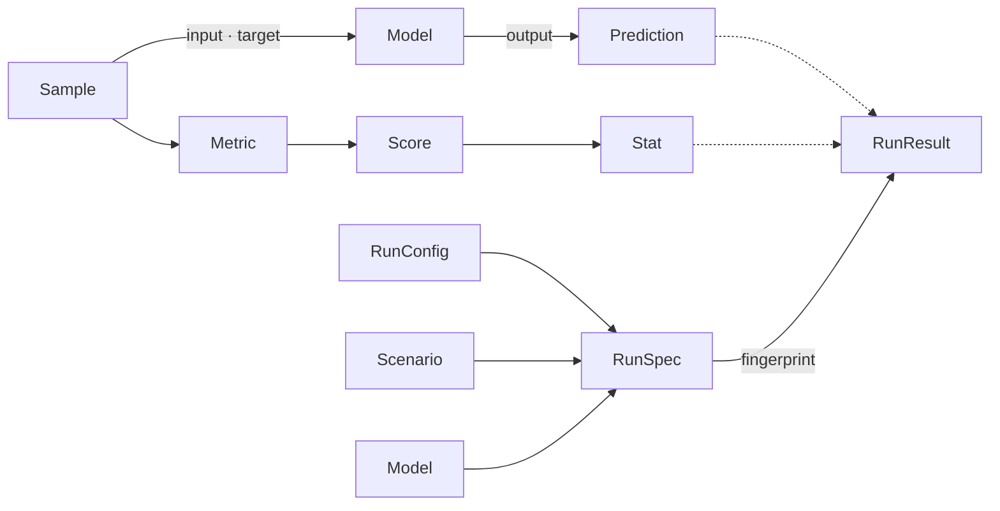
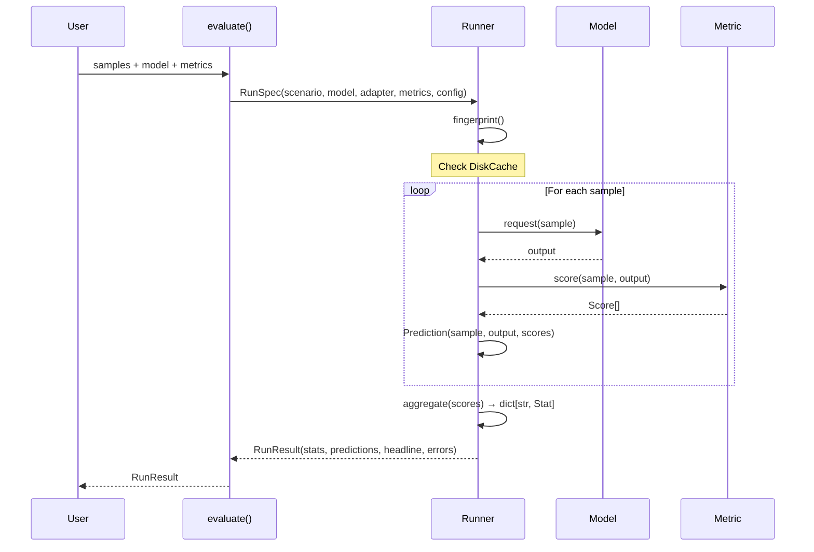

# Data Model

A small, composable set of dataclasses forms AuditKIT's evaluation spine. Benchmark text, RAG, judge, and security evaluations all flow through the same types. This page describes each type, its fields, and how they connect.

## Overview



## Sample

The unit of evaluation: one thing to ask a model and (optionally) what the correct answer looks like.

```python
@dataclass
class Sample:
    input: str
    target: Optional[Union[str, int]] = None
    id: Optional[str] = None
    task: str = ""
    kind: TaskKind = TaskKind.GENERATIVE
    choices: Optional[list[str]] = None
    retrieval_context: Optional[list[str]] = None
    metadata: dict[str, Any] = field(default_factory=dict)
    tags: list[str] = field(default_factory=list)
    actual_output: Optional[str] = None
```

| Field | Type | Description |
|---|---|---|
| `input` | `str` | The prompt or input presented to the model. |
| `target` | `Optional[str \| int]` | The reference answer (gold). When present the sample is *golden* (`is_golden == True`). |
| `id` | `Optional[str]` | Unique identifier for the sample. Auto-assigned from index if `None`. |
| `task` | `str` | Task name or label (e.g. `"mmlu:stem"`). Used for grouping in reports. |
| `kind` | `TaskKind` | The kind of evaluation task. One of `mcq`, `generative`, `rag`, `security`, `performance`, `language_modeling`. |
| `choices` | `Optional[list[str]]` | Candidate answers for multiple-choice or loglikelihood tasks. |
| `retrieval_context` | `Optional[list[str]]` | Retrieved document chunks for RAG evaluation. |
| `metadata` | `dict[str, Any]` | Arbitrary key-value metadata attached to the sample. |
| `tags` | `list[str]` | Tags for filtering and categorising samples. |
| `actual_output` | `Optional[str]` | The output produced by the model during a previous run. Used when re-scoring without re-running. |

**Properties:**

- `is_golden` — `True` when `target` is not `None`.
- `input_text` — The input as plain text.

## Score

One measurement of one sample: a value plus the metadata needed to interpret it.

```python
@dataclass
class Score:
    name: str
    value: float
    kind: ScoreKind = ScoreKind.BENCHMARK
    data_type: DataType = DataType.NUMERIC
    direction: Direction = Direction.MAXIMIZE
    label: Optional[str] = None
    reason: Optional[str] = None
    threshold: Optional[float] = None
    weight: float = 1.0
    source: Source = Source.SDK
    metadata: dict[str, Any] = field(default_factory=dict)
```

| Field | Type | Description |
|---|---|---|
| `name` | `str` | Metric name (e.g. `"exact_match"`, `"lexical_groundedness"`). |
| `value` | `float` | The numeric score value. |
| `kind` | `ScoreKind` | How the score was produced: `benchmark`, `judge`, `code`, `security`, `perf`, `human`, `rag`. |
| `data_type` | `DataType` | The value domain: `numeric`, `categorical`, or `boolean`. |
| `direction` | `Direction` | Which way is better: `maximize` or `minimize`. |
| `label` | `Optional[str]` | A human-readable label for categorical scores (e.g. `"pass"`, `"fail"`). |
| `reason` | `Optional[str]` | Explanation or justification, especially for LLM-as-judge scores. |
| `threshold` | `Optional[float]` | Pass/fail threshold. When set, determines the `passed` property. |
| `weight` | `float` | Relative weight when aggregating multiple scores (default `1.0`). |
| `source` | `Source` | Origin of the score: `sdk`, `ui`, or `online`. |
| `metadata` | `dict[str, Any]` | Arbitrary metadata (e.g. judge parameters, token usage). |

**Property:**

- `passed` — `Optional[bool]`. Compares `value` against `threshold` honouring `direction`. Returns `None` when no threshold is set.

## Stat

A running statistical summary of many values, used for per-metric aggregation.

```python
class Stat:
    def __init__(self, name: str) -> None: ...
```

| Property | Type | Description |
|---|---|---|
| `name` | `str` | The metric name this stat summarises. |
| `count` | `int` | Number of values recorded. |
| `mean` | `float` | Arithmetic mean. Returns `0.0` when empty. |
| `std` | `float` | Population standard deviation. Returns `0.0` for fewer than 2 values. |
| `stderr` | `float` | Standard error of the mean (`std / sqrt(n)`). Returns `0.0` for fewer than 2 values. |
| `min` | `float` | Minimum value. Returns `0.0` when empty. |
| `max` | `float` | Maximum value. Returns `0.0` when empty. |

**Methods:**

| Method | Signature | Description |
|---|---|---|
| `add` | `(value: float) -> Stat` | Record one value (returns `self` for chaining). |
| `percentile` | `(p: float) -> float` | The `p`-th percentile (0..100) by linear interpolation. |
| `to_dict` | `() -> dict[str, Any]` | Serialise to a dictionary. |
| `from_dict` | `(data: dict[str, Any]) -> Stat` | Deserialise from a dictionary (class method). |

## Prediction

One sample's complete record: what was asked, what the model returned, and how it scored.

```python
@dataclass
class Prediction:
    run_id: str
    task: str
    sample_id: str
    prompt: str
    raw_output: Optional[str]
    parsed_answer: Optional[str]
    expected: Optional[str]
    correct: Optional[bool]
    score: Optional[float]
    choice_likelihoods: Optional[list[float]] = None
    context: Any = None
    metadata: dict[str, Any] = field(default_factory=dict)
```

| Field | Type | Description |
|---|---|---|
| `run_id` | `str` | The run this prediction belongs to. |
| `task` | `str` | Task name from the sample. |
| `sample_id` | `str` | The sample identifier. |
| `prompt` | `str` | The prompt sent to the model (text form). |
| `raw_output` | `Optional[str]` | The raw output from the model. |
| `parsed_answer` | `Optional[str]` | Post-processed/parsed answer. |
| `expected` | `Optional[str]` | The gold/reference answer (`sample.target`). |
| `correct` | `Optional[bool]` | Whether the answer passed the primary metric's threshold. |
| `score` | `Optional[float]` | The primary metric score value. |
| `choice_likelihoods` | `Optional[list[float]]` | Loglikelihoods for each choice (mcq tasks). |
| `context` | `Any` | Annotation context from annotators. |
| `metadata` | `dict[str, Any]` | Additional metadata including all per-sample scores. |

## RunResult

The return value of every evaluation: aggregate statistics, per-sample predictions, and provenance.

```python
@dataclass
class RunResult:
    run_id: str
    fingerprint: str
    stats: dict[str, Stat]
    predictions: list[Prediction]
    headline: dict[str, float]
    config: Any = None
    model_spec: Any = None
    errors: list[dict] = field(default_factory=list)
    failed_count: int = 0
    experiment_name: str | None = None
    tags: list[str] = field(default_factory=list)
    perf: dict[str, Any] = field(default_factory=dict)
    model_size: dict[str, Any] = field(default_factory=dict)
    token_usage: dict[str, int] = field(default_factory=dict)
```

| Field | Type | Description |
|---|---|---|
| `run_id` | `str` | Unique identifier for this run (typically equals `fingerprint`). |
| `fingerprint` | `str` | Stable SHA-256 hash of the run specification (see [Fingerprint](#fingerprint)). |
| `stats` | `dict[str, Stat]` | Per-metric aggregate statistics, keyed by metric name. |
| `predictions` | `list[Prediction]` | Per-sample prediction records. |
| `headline` | `dict[str, float]` | Per-metric means — the one-number summary. |
| `config` | `Any` (RunConfig) | The configuration used for this run. |
| `model_spec` | `Any` | String or object describing the model. |
| `errors` | `list[dict]` | Errors encountered during the run, each with `sample_id`, `metric`, and `error`. |
| `failed_count` | `int` | Number of samples that failed during evaluation. |
| `experiment_name` | `str \| None` | Optional experiment name for grouping runs. |
| `tags` | `list[str]` | Tags for categorising the run. |
| `perf` | `dict[str, Any]` | Measured latency/throughput (incl. real token throughput), timed from the run's own model calls. `{}` on the `reads_actual_output` path or a zero-request run. |
| `model_size` | `dict[str, Any]` | Real introspected parameter count/size for local backends; `{"is_local": False, "model_name": ...}` for hosted APIs (never a guess). |
| `token_usage` | `dict[str, int]` | Real, provider-reported `prompt_tokens`/`completion_tokens`/`total_tokens` — zero for backends that don't report usage. The only input `.cost()` needs. |

**Methods:**

| Method | Description |
|---|---|
| `summary()` | Human-readable metric table (mean ± stderr over n). |
| `metric_table()` | List of dicts with `name`, `mean`, `stderr`, `n` per metric. |
| `wrong_only()` | Filter predictions where `correct == False`. |
| `to_dict()` | Serialise to a JSON-compatible dictionary. |
| `from_dict(data)` | Deserialise from a dictionary (class method). |
| `save(path, fmt)` | Persist to JSON (full) or CSV (per-prediction rows). |
| `load(path)` | Load from a JSON file (class method). |

## RunConfig

The knobs that shape a run. All are optional, with sensible defaults.

```python
@dataclass
class RunConfig:
    num_fewshot: Union[int, None] = None
    limit: Union[int, None] = None
    seed: int = 0
    trials: int = 1
    batch_size: Union[str, int] = "auto"
    concurrency: int = 1
    split: SplitConfig | None = None
    temperature: float = 0.0
    top_p: float | None = None
    top_k: int | None = None
    max_tokens: int | None = None
    stop_sequences: list[str] | None = None
    presence_penalty: float | None = None
    frequency_penalty: float | None = None
    num_completions: int | None = None
    best_of: int | None = None
    timeout: float | None = None
    max_retries: int = 3
    retry_delay: float = 1.0
    judge_model: Union[str, None] = None
    judge_prompt_version: Union[str, None] = None
    extra: dict[str, Any] = field(default_factory=dict)
```

| Field | Type | Description |
|---|---|---|
| `num_fewshot` | `int \| None` | Number of few-shot examples. |
| `limit` | `int \| None` | Limit on the number of samples evaluated. |
| `seed` | `int` | Random seed (default `0`). |
| `trials` | `int` | Number of repeated trials per sample (default `1`). |
| `batch_size` | `str \| int` | Batch size for model inference (default `"auto"`). |
| `concurrency` | `int` | Max concurrent requests (default `1` -- only takes the chunked/parallel path above `1`, and only if the model backend declares `threadsafe = True`). |
| `split` | `SplitConfig \| None` | Dataset split configuration. |
| `temperature` | `float` | Model generation temperature (default `0.0`). |
| `top_p` | `float \| None` | Nucleus sampling parameter. |
| `top_k` | `int \| None` | Top-k sampling parameter. |
| `max_tokens` | `int \| None` | Maximum tokens to generate. |
| `stop_sequences` | `list[str] \| None` | Sequences that stop generation. |
| `presence_penalty` | `float \| None` | Presence penalty. |
| `frequency_penalty` | `float \| None` | Frequency penalty. |
| `num_completions` | `int \| None` | Number of completions to request. |
| `best_of` | `int \| None` | Best-of sampling. |
| `timeout` | `float \| None` | Request timeout in seconds. |
| `max_retries` | `int` | Max retries on failure (default `3`). |
| `retry_delay` | `float` | Base retry delay in seconds (default `1.0`, doubles each attempt). |
| `judge_model` | `str \| None` | Model used for LLM-as-judge scoring. |
| `judge_prompt_version` | `str \| None` | Version of the judge prompt template. |
| `extra` | `dict[str, Any]` | Catch-all for backend-specific parameters. |

## SplitConfig

Controls how samples are divided into train/validation/test sets.

```python
@dataclass
class SplitConfig:
    strategy: str = "sequential"
    train_ratio: float = 0.0
    val_ratio: float = 0.0
    test_ratio: float = 1.0
    fold: int = 0
    seed: int | None = None
```

| Field | Type | Description |
|---|---|---|
| `strategy` | `str` | `"sequential"`, `"random"`, or `"stratified"` (default `"sequential"`). |
| `train_ratio` | `float` | Proportion of samples for training (default `0.0`). |
| `val_ratio` | `float` | Proportion of samples for validation (default `0.0`). |
| `test_ratio` | `float` | Proportion of samples for testing (default `1.0`). |
| `fold` | `int` | Fold index for cross-validation (default `0`). |
| `seed` | `int \| None` | Random seed for shuffling (used by `"random"` strategy). |

## RunSpec

Binds together everything a run needs and produces a stable fingerprint.

```python
@dataclass
class RunSpec:
    scenario: "Scenario"
    model: "Model"
    adapter: "Adapter"
    metrics: list["Metric"]
    annotators: list[Any] = field(default_factory=list)
    extracted_by: str | None = None
    config: RunConfig = field(default_factory=RunConfig)
    run_name: str = ""
```

| Field | Type | Description |
|---|---|---|
| `scenario` | `Scenario` | The dataset or scenario providing samples. |
| `model` | `Model` | The model backend to evaluate. |
| `adapter` | `Adapter` | Converts samples to model requests (generation, chat, few-shot, etc.). |
| `metrics` | `list[Metric]` | Metrics to apply to each sample output. |
| `extracted_by` | `str \| None` | Names an annotator (by `.name`) whose `context["extracted"]` value should be scored instead of the raw output — applies to every metric in `metrics` uniformly, not per-metric. |
| `annotators` | `list[Annotator]` | Optional annotators that enrich the context before scoring. |
| `config` | `RunConfig` | Run configuration knobs. |
| `run_name` | `str` | Optional human-readable name for the run. |

**Method:**

- `fingerprint() -> str` — Returns a stable 16-character SHA-256 hex digest over the identity-defining parts of the run (model, scenario, adapter, metrics, seed, temperature, judge settings, etc.). Two runs with the same fingerprint are the same experiment.

## Fingerprint

Every `RunSpec` produces a stable fingerprint, a 16-character SHA-256 hex digest that uniquely identifies an evaluation configuration. Two runs with the same fingerprint are guaranteed to be the same experiment, which makes fingerprints the foundation of:

- **Caching** — If a fingerprint already exists in `DiskCache`, the cached `RunResult` is returned without re-running.
- **Reproducibility** — The fingerprint captures model identity, scenario, adapter method, metric list, run name, seed, few-shot count, trials, temperature, judge model, and judge prompt version.
- **Comparison** — `Experiment.leaderboard()` and `RunDiff` use fingerprints to match runs.
- **Provenance** — Every `RunResult` carries its fingerprint, linking results back to the exact configuration that produced them.

The fingerprint is computed by hashing a sorted JSON representation of the identity-relevant fields:

```python
def fingerprint(self) -> str:
    key = {
        "model": ..., "scenario": ..., "adapter": ..., "metrics": ...,
        "run_name": ..., "seed": ..., "num_fewshot": ..., "trials": ...,
        "temperature": ..., "judge_model": ..., "judge_prompt_version": ...,
    }
    blob = json.dumps(key, sort_keys=True, default=str).encode("utf-8")
    return hashlib.sha256(blob).hexdigest()[:16]
```

## Enumerations

### TaskKind

| Value | Description |
|---|---|
| `MCQ` | Multiple-choice question |
| `GENERATIVE` | Open-ended generation |
| `RAG` | Retrieval-augmented generation |
| `SECURITY` | Security metrics (keyword detection) |
| `PERFORMANCE` | Performance benchmarking |
| `LANGUAGE_MODELING` | Language modelling (perplexity) |

### ScoreKind

| Value | Description |
|---|---|
| `BENCHMARK` | Deterministic benchmark metric |
| `JUDGE` | LLM-as-judge score |
| `CODE` | Code execution score |
| `SECURITY` | Security evaluation score |
| `PERF` | Performance metric |
| `HUMAN` | Human-annotated score |
| `RAG` | RAG-specific metric |

### DataType

| Value | Description |
|---|---|
| `NUMERIC` | Floating-point or integer value |
| `CATEGORICAL` | Discrete category label |
| `BOOLEAN` | True/false value |

### Direction

| Value | Description |
|---|---|
| `MAXIMIZE` | Higher values are better |
| `MINIMIZE` | Lower values are better |

### Source

| Value | Description |
|---|---|
| `SDK` | Created via the Python SDK |
| `UI` | Created via the web UI |
| `ONLINE` | Created via the API |

## Data Flow



## Persistence

`RunResult` supports serialisation to both JSON and CSV formats:

- **JSON** — Full round-trip serialisation via `to_dict()` / `from_dict()`. Includes stats, predictions, config, errors, and metadata.
- **CSV** — Flat per-prediction rows suitable for spreadsheet analysis. Header includes all `Prediction` fields.

Run results can be persisted to disk with the experimental tracking layer via `Experiment` and `ExperimentDB`, which stores named experiments containing multiple `RunResult` objects in a local JSON store under `~/.local/share/auditkit/experiments/`.
