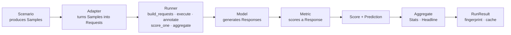
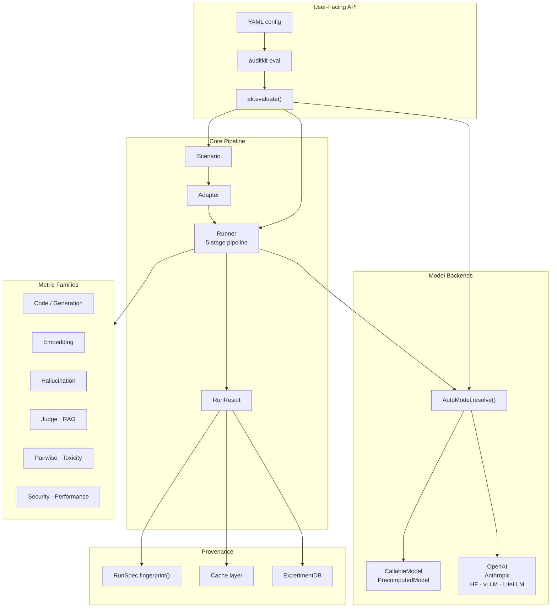
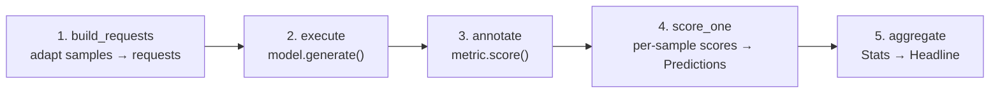
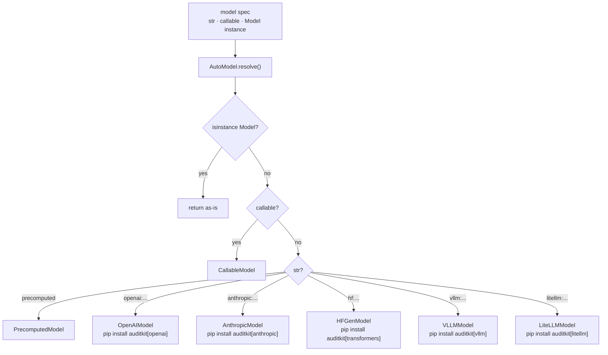
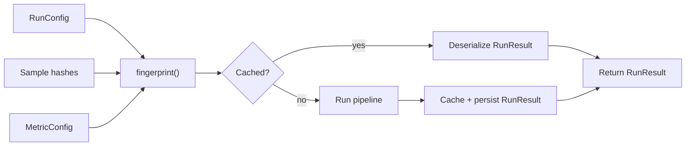

# System Design

AuditKIT's architecture is a layered processing spine that keeps concerns separate. Benchmark, LLM judge, RAG, and security evaluations all follow the same pipeline.

## Architecture Overview

The core dataflow is a linear spine with branching for scoring:



Each stage maps to a core abstraction:

| Stage | Abstraction | Input | Output |
|-------|-------------|-------|--------|
| Scenario | `Scenario.samples()` | config | `Iterator[Sample]` |
| Adapter | `Adapter.adapt(sample)` | `Sample` | `list[Request]` |
| Runner | `Runner.run()` | `list[Sample]` | `RunResult` |
| Model | `Model.generate(requests)` | `list[Request]` | `list[Result]` |
| Metric | `Metric.score(sample, output)` | `Sample` + `Result` | `Score` |
| Aggregate | `Stats` / `Headline` | `list[Score]` | aggregate dict |

## Component Topology



## The 5-Stage Runner

The `Runner` is the central orchestrator. Every call to `ak.evaluate()` passes through five stages:



### Stage 1 — `build_requests`

Materializes samples from the scenario, applies `SplitConfig` (train/val/test), and passes each sample through the adapter to produce one or more `Request` objects.

```python
def build_requests(self, scenario, adapter, config):
    samples = list(scenario.samples())
    samples = self._apply_limit(samples, config.limit)
    train, val, test = self._split_samples(samples, config.split)
    if hasattr(adapter, "pool"):
        adapter.pool = train  # FewShotAdapter's train-fold pool
    return [(s, adapter.adapt(s)) for s in test]
```

### Stage 2 — `execute`

Sends requests to the model backend. Supports concurrent execution via `ThreadPoolExecutor` when `concurrency > 1`.

```python
def execute(self, model, batch, concurrency=1):
    flat, counts = self._flatten(batch)
    if concurrency <= 1:
        results = model.generate(flat)
    else:
        chunks = self._chunk(flat, concurrency)
        with ThreadPoolExecutor(max_workers=concurrency) as pool:
            chunk_results = list(pool.map(model.generate, chunks))
        results = [r for cr in chunk_results for r in cr]
    return self._unflatten(batch, counts, results)
```

### Stage 3 — `annotate`

Runs each metric against each sample-output pair. Errors stay isolated per metric: a failing metric produces a fallback score instead of aborting the run.

### Stage 4 — `score_one`

Assembles per-sample `Score` objects into `Prediction` objects (one per sample). Tracks `correct` boolean and per-sample error metadata.

### Stage 5 — `aggregate`

Reduces all scores into aggregate `Stats`, computes a `Headline` summary metric, and produces the final `RunResult`.

## Adapter Catalog

Adapters own Stage 1 (`build_requests`): they decide *how* a `Sample` is turned into one or more model `Request`s: plain generation, chat-formatted, multiple-choice, few-shot, RAG-augmented, or a custom template. All adapters are registered in `ADAPTERS` (`auditkit/registry.py`) and implement `Adapter.adapt(sample, config) -> list[Request]`; prompt-bearing adapters also override `identity()` so their template/config participates in the run fingerprint (changing a system prompt or template invalidates the cache).

| Adapter | Registry key | Request shape | Example dataset / use case |
|---------|--------------|----------------|-----------------------------|
| `GenerationAdapter` | `"generation"` | 1 request, free-form `generate` | Open-ended QA or summarization, e.g. `gsm8k` — the model just answers `sample.input` directly, no formatting |
| `ChatAdapter` | `"chat"` | 1 request, `chat` with a system + user turn | Assistant-style datasets, e.g. a customer-support transcript scenario — wraps `sample.input` as a user message under a configurable `system_prompt` (default `"You are a helpful assistant."`) |
| `MCQAdapter` | `"mcq"` | `mcq_joint`: 1 `generate` request listing all choices; `mcq_loglikelihood`: N `loglikelihood` requests, one per choice | Multiple-choice benchmarks like `arc_easy`, `mmlu`, `hellaswag` — requires `sample.choices`; joint mode asks the model to pick a number, loglikelihood mode scores each choice's completion likelihood (mirrors how lm-eval scores MCQ tasks) |
| `FewShotAdapter` | `"fewshot"` | 1 request, `generate`, prefixed with `num_shots` examples drawn from a `pool` | Few-shot in-context learning benchmarks, e.g. `mmlu` 5-shot — `pool` is auto-populated from the run's train split; `RunConfig.num_fewshot` overrides the adapter's own `num_shots` default |
| `InstructionAdapter` | `"instruction"` | 1 request, `generate`, prefixed with a fixed instruction string | Task datasets with no built-in instruction, e.g. a raw sentiment-classification CSV — prepends `instruction` (default `"Answer the following question:"`) ahead of `sample.input` |
| `RAGAdapter` | `"rag"` | 1 request, `generate`, with retrieved context appended | RAG evaluation datasets carrying `sample.retrieval_context`, e.g. a document-QA scenario — raises if `retrieval_context` is empty; `max_context_chars` truncates long context |
| `TemplateAdapter` | `"template"` | 1 request, `generate`, rendered from a custom format string | Any dataset needing a bespoke prompt shape — `template` is a Python format string with `{input}`, `{target}`, `{context}` placeholders, e.g. `"Q: {input}\nContext: {context}\nA:"` |

To add a new one, see [Adding a new adapter](#adding-a-new-adapter) below.

## Metric Families

All families follow the `Metric` ABC, `score(sample, output, context) -> Score`:

| Family | Example Metrics | Dependencies |
|--------|----------------|-------------|
| **Code / Deterministic** | `Equals`, `Contains`, `Regex`, `F1Score`, `Levenshtein`, `IsJson` | none |
| **Generation** | `Bleu`, `RogueL`, `ChrF`, `WER`, `Perplexity`, `BertScore` | none stdlib; `[transformers]` for PPL, `[bert-score]` for BERTScore |
| **Embedding** | `CosineSimilarity`, `TokenOverlap`, `BM25Similarity` | `[transformers]` for `CosineSimilarity` only; `TokenOverlap`/`BM25Similarity` need nothing |
| **Hallucination** | `FactualConsistency` | `[transformers]` |
| **Judge** | `GEval` with weighted `RubricItem`s | None (uses configured judge model) |
| **RAG** | `LexicalGroundedness`, `ContextCoverage`, `ContextOverlap`, `AnswerOverlap` | none |
| **Pairwise** | `WinRate`, `EloScore`, `PreferenceAccuracy` | none |
| **Toxicity / Bias** | `ToxicityScore`, `RepresentationSkew`, `HateSpeechScore`, `BiasJudge` | none (`BiasJudge` needs a judge model) |
| **Security** | `KeywordDetector`, `DefconGrade` | none |
| **Performance** | `LatencyStats`, `Throughput` | none |

All metrics inherit `is_deterministic`. Non-deterministic metrics (e.g. `Perplexity`, `BertScore`, `GEval`) are labelled `is_deterministic = False` and get consistent seed handling.

## Model Backends

Models are resolved through `AutoModel.resolve()`, a factory that dispatches on string prefix:



### T0 — Zero-dependency backends

| Backend | Class | Behavior |
|---------|-------|----------|
| `callable` | `CallableModel` | Wraps any `list[str] -> list[str]` function |
| `"precomputed"` | `PrecomputedModel` | Returns each sample's own `actual_output`, already set |

### T1 — Extras-required backends

| Prefix | Class | Extra | Thread-safe |
|--------|-------|-------|-------------|
| `"openai:"` | `OpenAIModel` | `[openai]` | Yes |
| `"anthropic:"` | `AnthropicModel` | `[anthropic]` | Yes |
| `"hf:"` | `HFGenModel` | `[transformers]` | No (single GPU) |
| `"vllm:"` | `VLLMModel` | `[vllm]` | Yes |
| `"litellm:"` | `LiteLLMModel` | `[litellm]` | Yes |
| `"api:"` | `APIModel` | `[requests]` | Yes |

API key resolution follows priority: explicit `api_key=` kwarg > environment variable > config file.

## Provenance & Reproducibility

Every run produces a `RunResult` with a deterministic fingerprint:

### `RunSpec.fingerprint()`

```python
fingerprint = hashlib.sha256()
fingerprint.update(json.dumps(spec.model_config, sort_keys=True).encode())
fingerprint.update(json.dumps(spec.metric_config, sort_keys=True).encode())
fingerprint.update(json.dumps(spec.scenario_config, sort_keys=True).encode())
fingerprint.update(json.dumps(spec.run_config, sort_keys=True).encode())
return fingerprint.hexdigest()[:16]
```

The fingerprint covers:

- **Model config**: model string, temperature, max_tokens, all kwargs
- **Metric config**: metric class names, parameters, judge model config
- **Scenario config**: scenario class, split, subject, limit
- **Run config**: adapter, concurrency, seed, split strategy, tags

### Cache Layer

`RunResult` objects can be serialized and cached by fingerprint. Subsequent `evaluate()` calls with the identical fingerprint always load from cache automatically -- there's no `force=`/bypass flag; to re-run, change something that affects the fingerprint, or clear the cache directly (`DiskCache().clear()`).

### ExperimentDB

Named experiments persist to `~/.local/share/auditkit/experiments/` as JSON. The `Experiment` class supports aggregation, leaderboard, pairwise diff, and bootstrap significance testing.

```python
exp = ak.ExperimentDB().load("my_experiment")
exp.aggregate()        # mean across runs
exp.leaderboard()      # per-run metrics
exp.significance("exact_match")  # p-value via bootstrap
```



## Extensibility

### Adding a new metric

Subclass `Metric`, implement `score()`, register it:

```python
from auditkit.metric import Metric, Score
from auditkit.scoring import ScoreKind
from auditkit.types import Direction

class MyMetric(Metric):
    name = "my_metric"
    kind = ScoreKind.BENCHMARK
    direction = Direction.MAXIMIZE  # required -- says higher = better here
    is_deterministic = True
    required_fields = frozenset({"target"})

    def score(self, sample, output, context=None) -> Score:
        value = 1.0 if output == sample.target else 0.0
        return Score(name=self.name, value=value, kind=self.kind)
```

Add to `metrics/__init__.py` `__all__` and optionally register in the metric registry.

### Adding a new model backend

Create a class inheriting from `Model` and register in `AutoModel.resolve()`:

```python
from auditkit.model import Model, Result_, Generated

class MyModel(Model):
    name = "my_model"

    def generate(self, requests):
        results = []
        for req in requests:
            text = my_api_call(str(req.prompt))
            results.append(Result_(completions=[Generated(text=text)]))
        return results
```

Add to `AutoModel._T1_BACKENDS` in `model/__init__.py`:

```python
"my_model:": ("model.my_model", "MyModel", "my-extra"),
```

### Adding a new scenario

Subclass `Scenario`, implement `samples()`, register:

```python
from auditkit.registry import SCENARIOS

@SCENARIOS.register("my_benchmark")
class MyScenario(Scenario):
    def samples(self):
        yield Sample(input="...", target="...")
```

### Adding a new adapter

Subclass `Adapter`, implement `adapt()`:

```python
from auditkit.adapter import Adapter, Request

class MyAdapter(Adapter):
    def adapt(self, sample, config):
        return [Request(prompt=my_template(sample.input))]
```

### Technique extensions

- **Custom metrics**: subclass `Metric`, implement `score()`, declare `direction=`
- **Custom judges**: pass any model to `GEval(judge_model="openai:gpt-4o")`
- **Custom split strategies**: `SplitConfig(strategy=...)` accepts `"sequential"`/`"random"`/`"stratified"` today; there's no pluggable strategy ABC yet
- **Caching**: `DiskCache` is the only cache implementation — no pluggable backend interface yet
