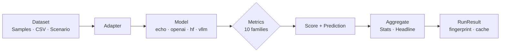

<div class="ak-hero" markdown>


<h1 class="ak-hero-title">Evaluate any model<br>on <em>any</em> dataset and <em>any</em> task.</h1>

<p class="ak-tagline">
One library for benchmark, LLM-as-judge, RAG, model-comparison, and performance
evaluation — zero required deps.
</p>

[Get started](getting_started.md){ .md-button .md-button--primary }
[View on GitHub](https://github.com/Lexsi-Labs/AuditKIT){ .md-button }

<p class="ak-chips">
<span>v1.0.0</span>
<span>LSAL v1.2</span>
<span>Python 3.10+</span>
<span>zero required deps</span>
<span>10 metric families</span>
</p>

</div>



<div class="grid cards" markdown>

-   :material-scale-balance:{ .lg .middle } **Benchmark metrics**

    ---

    Exact match, F1, BLEU, ROUGE, ChrF, METEOR, perplexity, WER, BERTScore, and more — all with zero required deps unless noted.

-   :material-account-balance:{ .lg .middle } **LLM-as-judge**

    ---

    `GEval` with custom rubrics and weighted rubric items. Use any model as the judge — OpenAI, Anthropic, Ollama, or local.

-   :material-speedometer:{ .lg .middle } **Performance, size & cost**

    ---

    Latency, throughput, real model size (params/sparsity/MB), provider token usage, and dollar cost — measured automatically on every run and folded into comparisons.

-   :material-compare:{ .lg .middle } **Model comparison**

    ---

    `compare_models()` runs the same dataset against multiple models. Bootstrap significance tests for pairwise differences.

-   :material-chart-timeline-variant:{ .lg .middle } **Experiment tracking**

    ---

    Named experiments with `ExperimentDB`, MLflow logging, cross-run comparison, and bootstrap significance tests.

-   :material-console-line:{ .lg .middle } **CLI + YAML config**

    ---

    `auditkit eval`, `init`, `list`, `compare`. Define evaluations in YAML with `prompts:`, model config, tags, and split strategies.

</div>

---

## Quick start

```python
import auditkit as ak

samples = [
    ak.Sample(input="What is 2+2?", target="4"),
    ak.Sample(input="What is 3+3?", target="6"),
]

result = ak.evaluate(samples, model=lambda prompts: ["4", "6"])
print(result.headline)
```

Install: `pip install auditkit`

See the [Getting Started](getting_started.md) guide for more.

---

## Why AuditKIT?

- **One spine for everything.** Benchmark text, LLM output, RAG, model comparison, performance — same API, same data model.
- **Zero required dependencies.** Core runs on stdlib. Heavy backends are optional extras.
- **Provenance-first.** Every run has a stable fingerprint (sha256) for caching, comparison, and reproducibility.
- **Library + CLI + YAML.** Use as a Python library, from the command line, or with declarative YAML configs.
- **Lexsi Labs.** Built by the same team behind [CuratorKIT](https://github.com/Lexsi-Labs/CuratorKIT) (data curation) and [TabTune](https://github.com/Lexsi-Labs/TabTune) (tabular foundation models).

<div class="ak-lexsi-footer">
<p>
  <strong><a href="https://lexsi.ai" target="_blank" rel="noopener">Lexsi Labs</a></strong>
  —
  <span class="ak-lexsi-on-light">AuditKIT</span>
  <span class="ak-lexsi-on-dark">AuditKIT</span>
</p>
</div>
